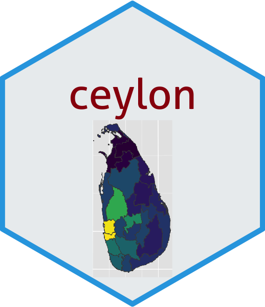

```{r setup, include=FALSE}
library(knitr)
options(htmltools.dir.version = FALSE)
opts_chunk$set(
  warning = FALSE,
  message = FALSE,
  echo = FALSE,
  cache.path = 'cache/',
  fig.align = 'center',
  cache = TRUE
)

library(tidyverse)
library(patchwork)

```

```{r xaringan-themer, include=FALSE, warning=FALSE}
library(xaringanthemer)
style_mono_accent(
   base_color = "#025859",
   link_color = "#1148ed",
   title_slide_background_color = "#025859",
  inverse_background_color = "#17ffa2",
  header_font_google = google_font("Josefin Sans"),
  text_font_google   = google_font("Montserrat", "300", "300i"),
  code_font_google   = google_font("Fira Mono"),
  title_slide_text_color = "#3be3dd",
  inverse_header_color = "#500252",
   inverse_text_color = "#041a5c",
   header_background_text_color = "#ffea00",
  base_font_size = "20px",
  text_font_size = "1.5rem",
  )
```

### Main packages required

```{r echo=TRUE}
# Data manipulation and plotting functions
library(tidyverse)

# sf: objects with simple features
library("sf")

# Provides a map of countries of the entire world
library("rnaturalearth")
library("rnaturalearthdata")
```

The combination of ggplot2 and sf therefore enables to programmatically create maps.

<!--https://r-spatial.org/r/2018/10/25/ggplot2-sf.html-->

---

```{r echo=TRUE}
world <- ne_countries(scale = "medium", returnclass = "sf")
class(world)

colnames(world)
```

---

```{r echo=TRUE}
world %>%
  filter(admin == "Sri Lanka")
```

---
Creating a base map of the world using ggplot2

```{r echo=TRUE, fig.width=11}
ggplot(data = world) + 
  geom_sf() #<<
```
---
```{r echo=TRUE, fig.width=11, fig.height=6}
ggplot(data = world) +
    geom_sf() +
    xlab("Longitude") + ylab("Latitude") +
    ggtitle("World map", 
            subtitle = paste0("(", #<<
                  length(unique(world$NAME)), " countries)")) #<<

```


---
Shows the population of each country using  the population (which is stored in the variable POP_EST of the world object)

```{r echo=TRUE, fig.width=11, fig.height=6}
ggplot(data = world) +
    geom_sf(aes(fill = pop_est)) + #<<
    scale_fill_viridis_c(option = "plasma") #<<
```

---

Shows the population of each country using the square root of the population (which is stored in the variable POP_EST of the world object)

```{r echo=TRUE, fig.width=11, fig.height=6}
ggplot(data = world) +
    geom_sf(aes(fill = pop_est)) +
    scale_fill_viridis_c(option = "plasma", trans = "sqrt") #<<
```
---

## `ceylon` package

The goal of ceylon is to provide data to plot maps of Sri Lanka.

https://github.com/thiyangt/ceylon

```{r echo=TRUE}
# install.packages("devtools")
# devtools::install_github("thiyangt/ceylon")
library(ceylon)
```

```{r   out.width = "20%", echo = FALSE, fig.cap='' }

```
---

Country level

.pull-left[
```{r echo=TRUE, eval=FALSE}
data(sf_sl_0)
ggplot(sf_sl_0) +
  geom_sf()
```
].pull-right[

```{r}
data(sf_sl_0)
ggplot(sf_sl_0) +
  geom_sf()
```

]
---
Provinces of Sri Lanka

```{r echo=TRUE}
data(province)
province
```
---
Provinces of Sri Lanka

.pull-left[
```{r echo=TRUE, eval=FALSE}
ggplot(province) + 
  geom_sf()
```
]..pull-right[

```{r }
ggplot(province) + 
  geom_sf()
```
]
---

Provinces of Sri Lanka

.pull-left[
```{r echo=TRUE, eval=FALSE}
ggplot(province) + 
  geom_sf(mapping = aes(fill = PROVINCE), #<<
          show.legend = TRUE) #<<
```
]..pull-right[

```{r }
ggplot(province) + 
  geom_sf(mapping = aes(fill = PROVINCE),
          show.legend = TRUE) #<<
```
]


---
Distribution of Population by Provinces
 
.pull-left[
```{r echo=TRUE, eval=FALSE}
ggplot(province) + 
  geom_sf(mapping = aes(fill = population),
          show.legend = TRUE)
```
]..pull-right[

```{r }
ggplot(province) + 
  geom_sf(mapping = aes(fill = population), #<<
          show.legend = TRUE)
```
]
---
Distribution of Population by Districts

.pull-left[
```{r echo=TRUE, eval=FALSE}
library(viridis)
data(district) #<<
ggplot(district) + #<<
  geom_sf(aes(fill = population),
          show.legend = TRUE) + 
  scale_fill_viridis()
```
]..pull-right[

```{r }
library(viridis)
data(district) #<<
ggplot(district) + #<<
  geom_sf(aes(fill = population),
          show.legend = TRUE) + 
  scale_fill_viridis()
```
]
---
Divisional secretariat

.pull-left[
```{r echo=TRUE, eval=FALSE}
data(sf_sl_3)
ggplot(sf_sl_3) + 
  geom_sf()
```
]..pull-right[

```{r }
data(sf_sl_3)
ggplot(sf_sl_3) + 
  geom_sf()
```
]
---
Join (merge) data with `dplyr` in R

```{r   out.width = "45%", echo = FALSE, fig.cap='' }
knitr::include_graphics("fig/2_dplyr-joins.png")
```

[Source: https://data-lessons.github.io/gapminder-R/12-joins.html](https://data-lessons.github.io/gapminder-R/12-joins.html)

[Learn more: https://rpubs.com/williamsurles/293454](https://rpubs.com/williamsurles/293454)
---
```{r echo=TRUE}
head(district)
```

---

## Dealing with our own datasets

```{r echo=TRUE}
DISTRICT <- c("Ampara", "Anuradhapura", "Badulla", 
              "Batticaloa", "Colombo", "Galle", "Gampaha",
              "Hambantota", "Jaffna", "Kalutara", "Kandy",
              "Kegalle", "Kilinochchi", "Kurunegala",
              "Mannar", "Matale", "Matara", "Monaragala",
              "Mullaitivu", "Nuwara eliya", "Polonnaruwa", 
              "Puttalam", "Ratnapura", "Trincomalee", 
              "Vavuniya"   )

covidcount<- c(13867, 14351, 14290, 9824, 132418, 42314, 111221, 18631,
              12222, 56672, 21369, 13225, 9597, 30507, 2523, 15211, 20905,
              14723, 2192, 12240, 5197, 14901, 22650, 4364, 3644)

newdate <- tibble(DISTRICT, covidcount )
```

---
## Convert case of a string

https://stringr.tidyverse.org/reference/case.html

.pull-left[
```{r echo=TRUE}
head(newdate)
```
].pull-right[

```{r echo=TRUE}
newdate <- newdate %>%
  mutate(DISTRICT= stringr::str_to_upper( #<<
    DISTRICT, locale = "en")) #<<

head(newdate)

```

]
---

Merge Data

```{r echo=TRUE}

full_data <- left_join(district, newdate, by= "DISTRICT")

head(full_data)
```
---
Distribution of Total Covid Count by Districts 

.pull-left[
```{r echo=TRUE, eval=FALSE}
ggplot(full_data) + #<<
  geom_sf(aes(fill = covidcount), #<<
          show.legend = TRUE) + 
  scale_fill_viridis()
```
].pull-right[

```{r }
ggplot(full_data) + #<<
  geom_sf(aes(fill = covidcount), #<<
          show.legend = TRUE) + 
  scale_fill_viridis()
```
]
---
class: inverse, middle, center

```{r}
icon::fa("github")
icon::fa("twitter")

```
pridiltal and thiyangt

# Acknowledgements:

This work was supported in part by RETINA research lab funded by the OWSD, a program unit of United Nations Educational, Scientific and Cultural Organization (UNESCO).


All rights reserved by Thiyanga S. Talagala and Priyanga D Talagala


