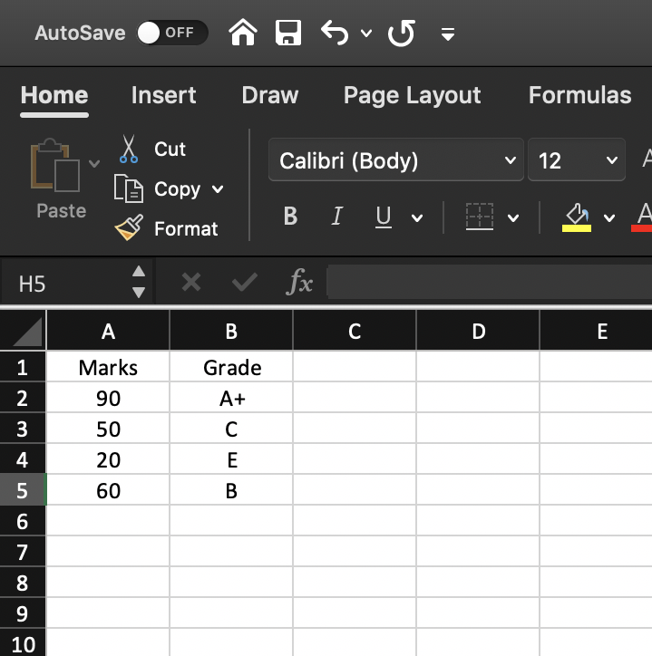
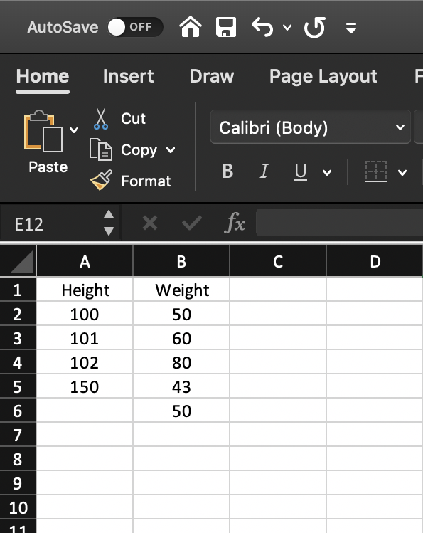
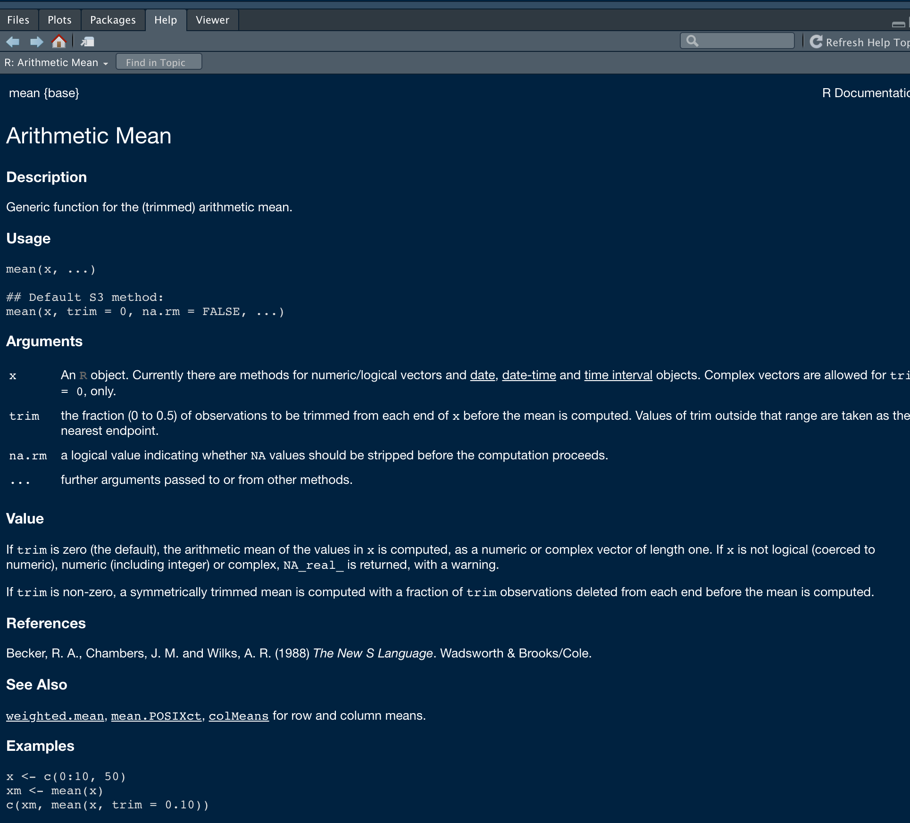

```{r setup, include=FALSE}
options(htmltools.dir.version = FALSE)
knitr::opts_chunk$set(
  fig.width=9, fig.height=3.5, fig.retina=3,
  out.width = "100%",
  cache = FALSE,
  echo = TRUE,
  message = FALSE, 
  warning = FALSE,
  fig.show = TRUE,
  hiline = TRUE,
  comment = NA
)
```

<style type="text/css">
.remark-slide-content {
    font-size: 35px;
}
</style>


<style type="text/css">
.remark-slide-content {
    font-size: 35px;
}
</style>

<style>
p.comment {
background-color: #DBDBDB;
padding: 10px;
border: 1px solid black;
margin-left: 25px;
border-radius: 5px;
font-style: italic;
}

</style>


```{css, echo = FALSE}
h1, #TOC>ul>li {
  color: #1b9e77;
  font-weight: bold;
}
h2, #TOC>ul>ul>li {
  color:  #1b9e77;
  #font-family:  "Times";
  font-weight: bold;
}
h3, #TOC>ul>ul>li {
  color: #00441b;
  #font-family:  "Times";
  font-weight: bold;
}
```

```{r xaringan-themer, include=FALSE, warning=FALSE}
library(xaringanthemer)
style_duo_accent(
  primary_color = "#081d58",
  title_slide_text_color = "#edf8b1",
  secondary_color = "#FF961C",
  inverse_header_color = "#081d58",
  text_font_size = "1em",
  text_color = "#000",
  text_bold_color = "#fd8d3c",

  
)
#style_solarized_light(text_font_google   = google_font("Josefin Sans", "400", "400i", "800i", "800"),
# text_color = "#000",
#  text_font_size = "1em")
#style_mono_light(
#  base_color = "#1c5253",
#  header_font_google = google_font("Josefin Sans"),
#  text_font_google   = google_font("Josefin Sans", "400", "400i", "800i", "800"),
#  code_font_google   = google_font("Fira Mono")
#)
```


.pull-left[

## Data structures

Way to **store and organize data** so that it can be used efficiently.

```{r, comment=NA}
marks <- c(100, 40, 34, 97, 98)
marks
```


]

--
.pull-right[

## Functions 

Tell R to **do something**

```{r, comment=NA}
mean(marks)
summary(marks)
```


]


---

## Data structures

```{r, comment=NA, echo=FALSE, out.width="80%"}
knitr::include_graphics("ds.png")

```

Source: Ceballos and Cardiel, 2013


---

## Creating vectors


Syntax

```r
vector_name <- c(element1, element2, element3)

```

Example

```{r, comment=NA}
x <- c(5, 6, 3, 1, 100)
x
```


---

## Combine two vectors

```{r}
p <- c(1, 2, 3)
p
q <- c(10, 20, 30)
q
r <- c(p, q)
r

```

---

## Vector with charactor elements

```{r}
names <- c("USJ", "UM", "UC", "UJ")
names

```

## Logical vector

```{r}
result <- c(TRUE, FALSE, FALSE, TRUE, FALSE)
result
```

---

## Simplifying vector creation

```{r}
id <- 1:10
id
treatment <- rep(1:3, each=2)
treatment
```

Additional resources: https://hellor.netlify.app/2021/week1/l12021.html#62

---

## Vector operations

```{r}
x <- c(1, 2, 3)
y <- c(10, 20, 30)
x+y
p <- c(100, 1000)
x+p
```

---
class: inverse, center, middle

# Your turn
---

1. Generate a sequence using the code `seq(from=1, to=10, by=1)`.

2. What other ways can you generate the same sequence? 

3. Using the function `rep` , create the below sequence 1, 2, 3, 4, 1, 2, 3, 4, 1, 2, 3, 4


```{r, echo=FALSE}
library(countdown)
countdown(minutes = 3L, seconds = 00)
```


---

## Vectors: Subsetting

```{r, comment=NA}
myvec <- 1:20; myvec
```

--

```{r, comment=NA}
myvec[1]
```

--
```{r, comment=NA}
myvec[5:10]
```

---
## Vectors: Subsetting (cont.)

--
```{r, comment=NA}
myvec[-1]
```
--

```{r, comment=NA}
myvec[myvec > 3]
```

---

## Changing values of a vector


```{r, comment=NA}
covid <- c(100, 30, 40, 50, -1, 100)
covid
covid[1] <- 50000
covid
```

---
## Changing values of a vector (cont.)

```{r, comment=NA}
covid[covid < 0] <- 0
covid
covid[c(1, 2)] <- c(1000, 10000)
covid

```

---

class: inverse, center, middle

# factor

---
## Required R package

```{r, comment=NA, message=TRUE, warning=TRUE}
library(tidyverse)
```

---
### Character vector vs Factor

- Factor prints all possible levels of the variable.

**Character vector**

```{r, comment=NA}
grade_character_vctr <- c("A", "D", "A", "C", "B")
grade_character_vctr
```


**Factor vector**

```{r, comment=NA}
grade_factor_vctr <- factor(c("A", "D", "A", "C", "B"), levels = c("A", "B", "C", "D", "E"))
grade_factor_vctr
```

---
### Character vector vs Factor (cont.)


- Let's create a contingency table with `table` function.

**Character vector output with table function**

```{r, comment=NA}
grade_character_vctr <- c("A", "D", "A", "C", "B")
table(grade_character_vctr)
```

---

**Factor vector (with levels) output with table function**

```{r, comment=NA}
grade_factor_vctr <- 
  factor(c("A", "D", "A", "C", "B"), 
         levels = c("A", "B", "C", "D", "E"))
table(grade_factor_vctr)
```

- Output corresponds to factor prints counts for all possible levels of the variable. Hence, with factors it is obvious when some levels contain no observations. 

---

### Character vector vs Factor (cont.)

- With factors you can't use values that are not listed in the levels, but with character vectors there is no such restrictions.


**Character vector**

```{r, comment=NA}
grade_character_vctr[2] <- "A+"
grade_character_vctr
```

---

**Factor vector**

```{r, comment=NA}
grade_factor_vctr[2] <- "A+"
grade_factor_vctr
```

---

## Factor: order levels

```{r, fih.height=3, comment=NA}
fv2 <- factor(c("1T","2T","3A","4A", "5A", "6B", "3A"))
fv2

```

--

```{r, comment=NA, fig.height=2}
library(ggplot2)
qplot(fv2, geom = "bar")
```

---


You can change the order of levels

```{r, comment=NA, fig.height=2}
fv2 <- factor(c("1T","2T","3A","4A", "5A", "6B", "3A"), 
              levels = c("3A", "4A", "5A", "6B", "1T", "2T"))
fv2
qplot(fv2, geom = "bar")
```


---

## Data set

```{r, comment=NA, echo=FALSE, out.width="50%"}

```


---

## Required R package

```{r, comment=NA, message=TRUE, warning=TRUE}
library(tidyverse)
```


---

## Create a tibble

.pull-left[

```{r, comment=NA, echo=FALSE, out.width="80%"}

```


]

.pull-right[

```{r, comment=NA, message=FALSE}
marks <- c(90, 50, 20, 60)
grade <- factor(c("A+", "C", "E", "B"))

final <- tibble(Marks = marks, Grade = grade)
final
```

]

---

## Create a tibble


```{r, comment=NA, message=FALSE, eval=FALSE}
marks <- c(90, 50, 20, 60)
grade <- factor(c("A+", "C", "E", "B"),
*                level = c("A+", "A", "B+", "B", "C", "D", "E"))
final <- tibble(Marks = marks, Grade = grade)
final
```

```{r, comment=NA, message=FALSE, echo=FALSE}
marks <- c(90, 50, 20, 60)
grade <- factor(c("A+", "C", "E", "B"),
                level = c("A+", "A", "B+", "B", "C", "D", "E"))
final <- tibble(Marks = marks, Grade = grade)
final
```


---
class: inverse, middle, center

# Functions in R


---

.pull-left[

# Data set: tibble

```{r, comment=NA, message=FALSE}
final
```


]

.pull-right[

## Functions

```{r, comment=NA, message=FALSE}
summary(final)
```

]


---

## Your Turn


```{r, comment=NA, echo=FALSE, out.width="40%"}

```

```{r, echo=FALSE}
library(countdown)
countdown(minutes = 1L, seconds = 00)
```

---

.pull-left[

```{r, comment=NA, echo=FALSE, out.width="70%"}

```


]

.pull-right[

```{r, comment=NA}
h <- c(100, 101, 102, 150, NA)
w <- c(50, 60, 80, 43, 50)
hwdata <- tibble(Height=h, Weight=w)
hwdata
```


]

---

.pull-left[

```{r, comment=NA}
hwdata
```

]

.pull-right[
```{r, comment=NA}
summary(hwdata)
```

]

---


.pull-left[

# Subsetting

```{r, comment=NA}
hwdata

hwdata[1, 1]
```
]

.pull-right[

```{r, comment=NA}

hwdata[, 1]
hwdata[1, ]
hwdata$Height
```

]


---

# Help file
.pull-left[
```{r}
hwdata$Weight
mean(hwdata$Weight)
```

]

.pull-right[
```{r}
hwdata$Height
mean(hwdata$Height)
```
]
---

# Help file
.pull-left[
```{r}
hwdata$Weight
mean(hwdata$Weight)
```

]

.pull-right[
```{r}
hwdata$Height
mean(hwdata$Height)
mean(hwdata$Height, na.rm=TRUE)
```
]

---


.pull-left[

# Help file

```r
?mean
help(mean)
```

]

.pull-right[

```{r, comment=NA, out.width="170%", echo=FALSE}

```
]
---

# Commenting

```{r}
mean(hwdata$Height, na.rm=TRUE) # compute mean of height
```


---

# Some useful functions

.pull-left[

```{r}
mean(hwdata$Weight) 
median(hwdata$Weight)
sd(hwdata$Weight) 
```


]

.pull-right[

```{r}
sum(hwdata$Weight)
length(hwdata$Weight) 
```


]

---

## Pipe operator (`%>%`)

.pull-left[

```{r}
mean(hwdata$Weight) 
mean(hwdata$Height, na.rm=TRUE)
```

]

.pull-right[
```{r}
library(magrittr)
hwdata$Weight %>% mean() 
hwdata$Height %>% mean(na.rm=TRUE)
```


]


---

## Pipe operator (`%>%`)


---
## Built-in dataset

```{r}
library(palmerpenguins)
data(penguins)
head(penguins)
```


---

## Skim data

```{r, eval=FALSE}
library(skimr)
skim(penguins)
```

---
## iris dataset


---


---

Use	the	R	dataset	“iris”	to	answer	the	following	questions:

1. How many rows and columns does iris have?

2. Select the first 4 rows.

3. Select the last 6 rows.

4. Select rows 10 to 20, with all columns in the iris dataset.

5. Select rows 10 to 20 with only the Species, Petal.Width and Petal.Length.

6. Create a single vector (a new object) called ‘width’ that is the Sepal.Width column of iris.

7.  What are the column names and data types of the different columns in iris?

8. How many rows in the iris dataset have `Petal.Length` larger than 5 and `Sepal.Width` smaller than 3?


```{r, echo=FALSE}
library(countdown)
countdown(minutes = 5L, seconds = 00)
```
---

class: inverse, cover, middle

# Recap

 ✅ Data structures and functions
 
 ✅  Factors
 
 ✅ Working with packages
 
 ✅ Create a tibble
 
 ✅ Help file
 
 ✅ Commenting
 

 
 
 
 