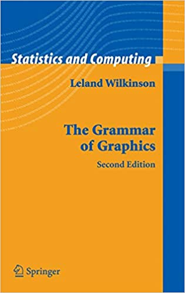
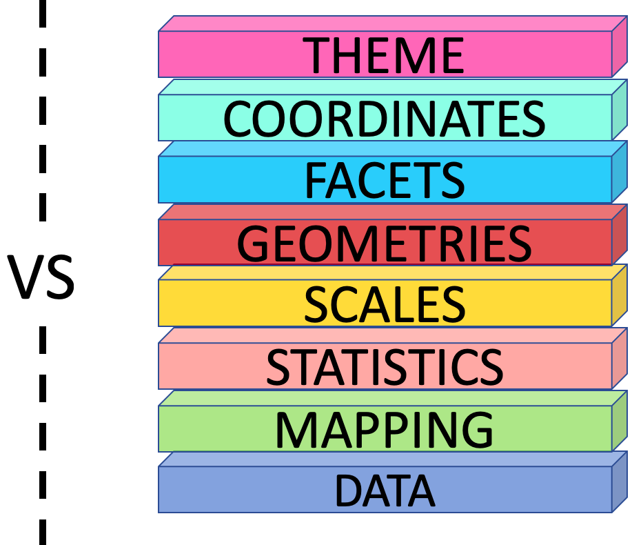
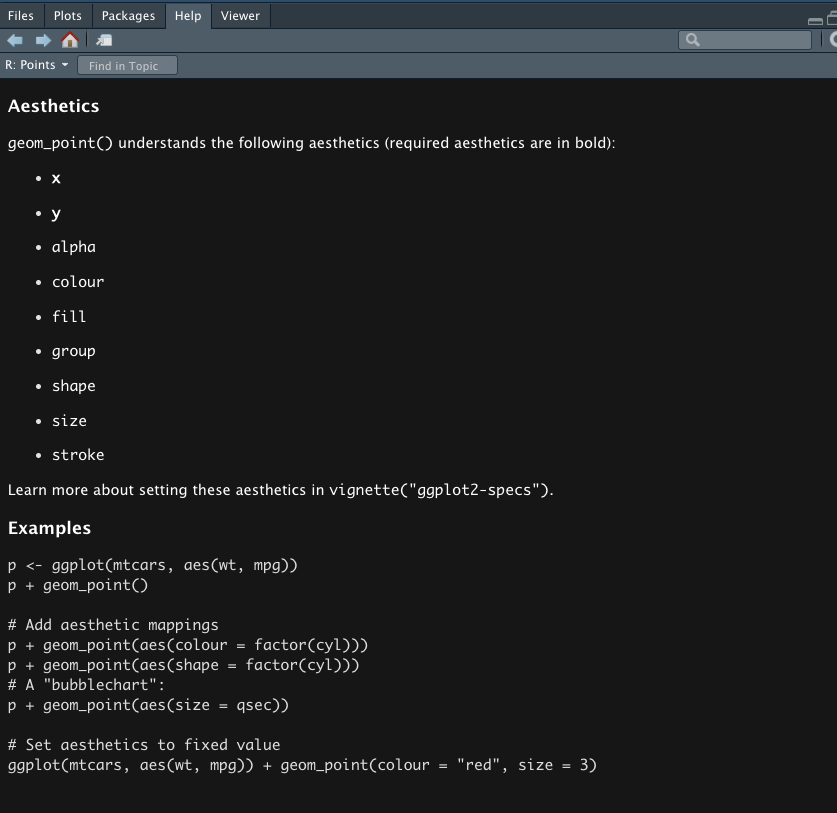
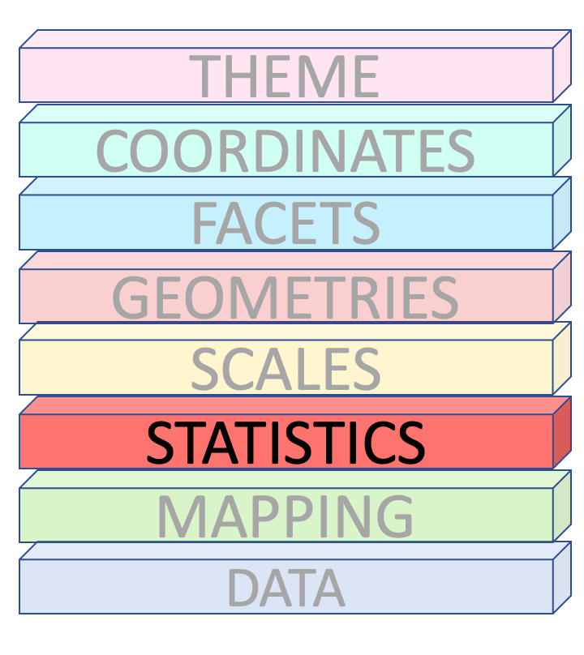
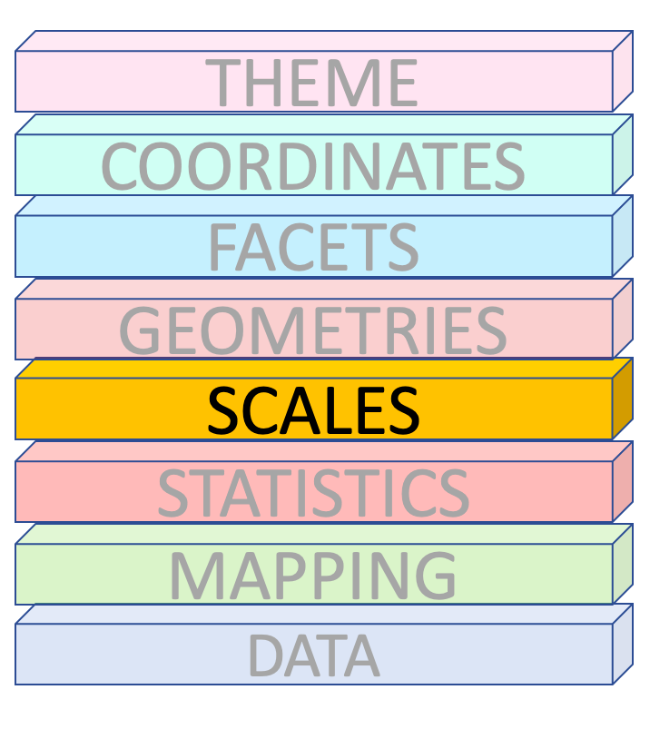
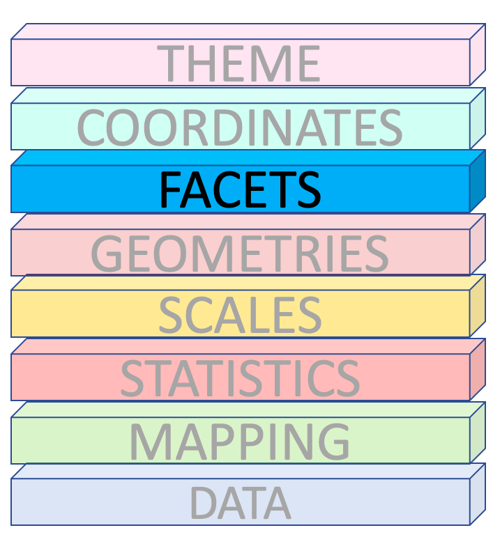
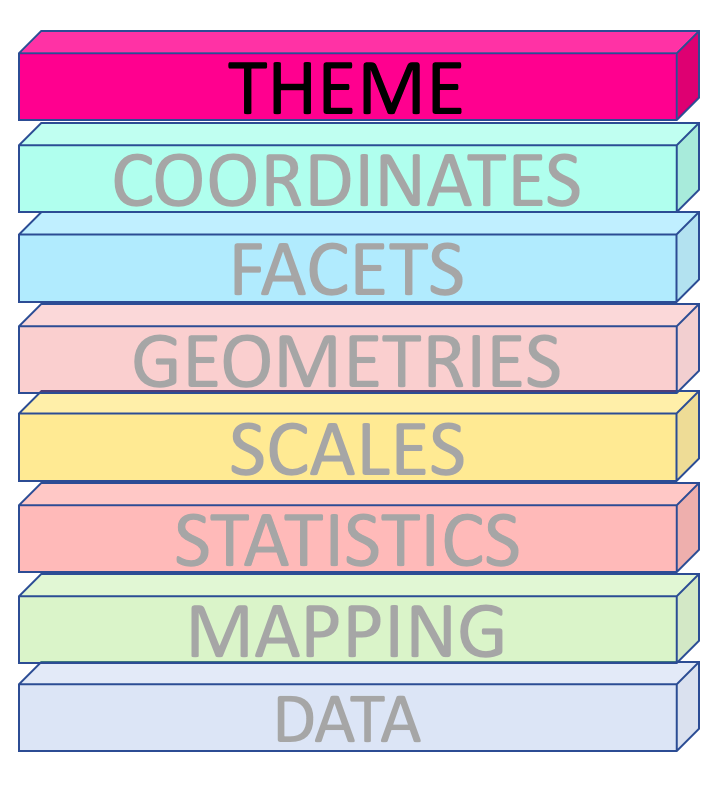
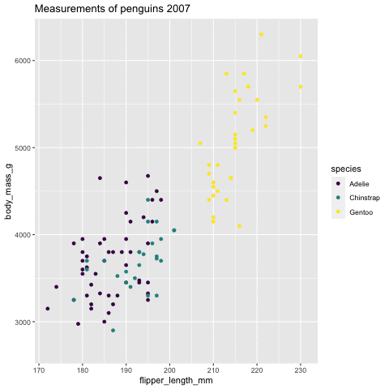
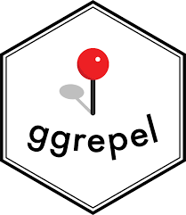

```{r setup, include=FALSE}
library(knitr)
options(htmltools.dir.version = FALSE)
opts_chunk$set(
  warning = FALSE,
  message = FALSE,
  echo = FALSE,
  cache.path = 'cache/',
  fig.align = 'center',
  cache = TRUE
)

library(tidyverse)
library(patchwork)

```

```{r xaringan-themer, include=FALSE, warning=FALSE}
library(xaringanthemer)
style_mono_accent(
   base_color = "#025859",
   link_color = "#4049ad",
   title_slide_background_color = "#4049ad",
  inverse_background_color = "#4049ad",
  header_font_google = google_font("Josefin Sans"),
  text_font_google   = google_font("Montserrat", "300", "300i"),
  code_font_google   = google_font("Fira Mono"),
  title_slide_text_color = "#ffea00",
  inverse_header_color = "#ffea00",
  header_background_text_color = "#ffea00",
  base_font_size = "20px",
  text_font_size = "1.2rem",
  )
```

background-image:url('fig/tidyworkflow1.png')
background-position: 50% 80%
background-size: 85%
class: top, center
# Tidy Workflow
---

background-image:url('fig/tidyworkflow2.png')
background-position: 50% 80%
background-size: 85%
class: top, center
# Tidy Workflow
---

background-image:url('fig/tidyworkflow3.png')
background-position: 50% 80%
background-size: 85%
class: top, center
# Tidy Workflow
---

## The Datasaurus Dozen

<!--Data visualization and storytelling has always been one of the most important phases of any data science pipeline involving extracting meaningful insights from data, regardless of the complexity of the data or the project. Take a simple example of ‘The Datasaurus Dozen’ — twelve different datasets depicted in the following figure.

https://towardsdatascience.com/a-comprehensive-guide-to-the-grammar-of-graphics-for-effective-visualization-of-multi-dimensional-1f92b4ed4149-->

.pull-left[
```{r echo=TRUE, fig.height=4, fig.width=4, cache=TRUE, eval=FALSE}
library(datasauRus)
library(ggplot2)

datasaurus_dozen %>%
  ggplot(aes(x, y, color = dataset)) +
  geom_point(show.legend = FALSE) +
  facet_wrap(~dataset, ncol = 4)

```

] .pull-right[

```{r echo=FALSE, out.width="100%"}
library(datasauRus)
library(ggplot2)

datasaurus_dozen %>%
  ggplot(aes(x, y, color = dataset)) +
  geom_point(show.legend = FALSE) +
  theme(aspect.ratio = 1)+
  facet_wrap(~dataset, ncol = 4)  


```

]

---

## The Datasaurus Dozen

.pull-left[
```{r echo=TRUE, fig.height=4, fig.width=4, cache=TRUE, eval=FALSE}
library(datasauRus)
library(ggplot2)

datasaurus_dozen %>%
  ggplot(aes(x, y, color = dataset)) +
  geom_point(show.legend = FALSE) +
  facet_wrap(~dataset, ncol = 4)

```

```{r}
library(datasauRus)
dino <- datasaurus_dozen %>%
  filter(dataset == "dino")
```

</br>

Summary statistics | 
-------------------|----
X Mean     | `r round(mean(dino$x),3)`
Y Mean     | `r round(mean(dino$y),3)`
X SD    | `r round(sd(dino$x),3)`
Y SD     | `r round(sd(dino$y),3)`
Corr.    |  `r round(cor(dino$x, dino$y),3)`

`The Datasaurus was created by Alberto Cairo`

] .pull-right[

```{r echo=FALSE, out.width="100%"}
library(datasauRus)
library(ggplot2)

datasaurus_dozen %>%
  ggplot(aes(x, y, color = dataset)) +
  geom_point(show.legend = FALSE) +
  theme(aspect.ratio = 1)+
  facet_wrap(~dataset, ncol = 4)  


```

]


<!-- https://r-mageddon.netlify.app/post/reanimating-the-datasaurus/


Can you guess what is common among these very different looking sets of data?

Essentially the Datasaurus Dozen is a playful twist on the classic statistical dataset; Anscombe’s Quartet. The Datasaurus Dozen is a group of twelve datasets, with nigh-identical summary statistics, but when plotted on a graph they prove to be distinctly dissimilar. Imagine my delight when I found the Datasaurus Dozen was available on CRAN in the datasauRus package.

https://towardsdatascience.com/a-comprehensive-guide-to-the-grammar-of-graphics-for-effective-visualization-of-multi-dimensional-1f92b4ed4149

It turned out that creating an animated version of the Datasaurus Dozen was absurdly simple, taking only 4 lines of code.

This is a fun variant of the well known Anscombe’s quartet.

It seems crazy to me that all these datasets have the same means, standard deviations and correlations!


This is a fun variant of the well known Anscombe’s quartet, which many of you might be very familiar with, as depicted in the following figure.

The key takeaway from these demonstrations would be, “Do not trust your data blindly, and start modeling on your data”. Summary statistics can always be deceptive. Always visualize and understand your data attributes before moving on to feature engineering and building statistical, machine learning and deep learning models.

-->

---
class: inverse, middle, center

# Never trust summary statistics <span style="color:#ff00b3">ALONE </span>


--

##  Always visualize your data

<!-- http://www.thefunctionalart.com/2016/08/download-datasaurus-never-trust-summary.html

https://cran.r-project.org/web/packages/datasauRus/vignettes/Datasaurus.html


https://cran.r-project.org/web/packages/datasauRus/vignettes/Datasaurus.html
-->
---
class: inverse, middle, center

# The Grammar of Graphics


---


class: inverse, middle, center

### The Book
# The Grammar of Graphics

```{r   out.width = "25%", echo = FALSE, fig.cap='' }

```

<!-- The original grammar of graphics framework was proposed by Leland Wilkinson, which covers all major aspects pertaining to effective data visualization in detail. I would definitely recommend interested readers to check out the book on it, whenever they get a chance!
-->

---
<!--https://flowingdata.com/2016/03/22/comparing-ggplot2-and-r-base-graphics/-->


```{r base}
library(palmerpenguins)
data <- penguins %>%
  count(species, name ='Count')
labels <- data$species

data2 <- c(7,12,28,3,41)
```


.pull-left[
R Base Graphics 
```{r  fig.height=3.5}
pie(data$Count,labels, radius = 1, main = "pie(data$Count,labels, radius = 1)")
```

```{r  fig.height=4}
plot(data2,type = "o", main = "plot(data2,type = ''o'')")
```

]
.pull-right[

```{r  fig.height=3.5}
barplot(data$Count, names.arg = labels, main = "barplot(data$Count, names.arg = labels)")
```

```{r  fig.height=4}
plot(x= penguins$flipper_length_mm,
     y = penguins$body_mass_g, main = "plot(x= penguins$flipper_length_mm,
     y = penguins$body_mass_g)")
```

]
---
class: middle, center
## The Grammar of Graphics

.pull-left[

.pull-left[
Pie Chart
```{r  fig.height=6}
pie(data$Count,labels, radius = 1)
```

Line Chart
```{r  fig.height=6}
plot(data2,type = "o")
```

]
.pull-right[

Bar Chart
```{r  fig.height=6}
barplot(data$Count, names.arg = labels)
```

Scatterplot
```{r  fig.height=6}
plot(x= penguins$flipper_length_mm,
     y = penguins$body_mass_g)
```
]
].pull-right[

```{r   out.height="100%" }

```
]


---

class: inverse, middle, center

<!--https://medium.com/@zoldin/introduction-to-ggplot2-the-grammar-81d10e11d908-->

# The ggplot2 API

```{r   out.width = "40%", echo = FALSE, fig.cap=''}
knitr::include_graphics("fig/ggplot.png")
```
---

class: middle, center

## Which dataset to plot?

```{r   out.width = "40%", echo = FALSE, fig.cap=''}
knitr::include_graphics("fig/8_GG_1.png")
```


---

.pull-left[
## `palmerpenguins` data
<!--The palmerpenguins data contains size measurements for three penguin species observed on three islands in the Palmer Archipelago, Antarctica.

https://allisonhorst.github.io/palmerpenguins/articles/intro.html
-->

The Palmer Archipelago penguins. Artwork by `@allison_horst`.

```{r   out.width = "100%", echo = FALSE, fig.cap=''}
knitr::include_graphics("fig/17_lter_penguins.png")
```

```{r   out.width = "70%", echo = FALSE, fig.cap=''}
knitr::include_graphics("fig/18_culmen_depth.png")
```
].pull-right[

```{r   out.width = "35%", echo = FALSE, fig.cap='' }
knitr::include_graphics("fig/15_palmerpenguins.png")
```
```{r comment=NA}
head(penguins)
glimpse(penguins)
```
]

---
## Which dataset to plot?


```{r echo=TRUE, eval = FALSE}

ggplot() 
```

```{r fig.height=5}

ggplot(data = penguins) +
  theme(text = element_text(size=14))
```


---
## Which dataset to plot?


```{r echo=TRUE, eval = FALSE}

ggplot(data = penguins) #<< 
```

```{r fig.height=5}

ggplot(data = penguins) +
  theme(text = element_text(size=14))
```


---

class: middle, center

## Mapping 

```{r   out.width = "40%", echo = FALSE, fig.cap=''}
knitr::include_graphics("fig/40_mapping.png")
```


---
## Which columns to use for x and y?


```{r echo=TRUE, eval = FALSE}

ggplot(data = penguins,
       mapping = aes(x = flipper_length_mm, #<<
                     y = body_mass_g))  #<<
```

```{r  fig.height=5}

ggplot(data = penguins,
       mapping = aes(x = flipper_length_mm,
                     y = body_mass_g)) +
  theme(text = element_text(size=14))
```


---
class: middle, center

## Geometries

```{r   out.width = "40%", echo = FALSE, fig.cap=''}
knitr::include_graphics("fig/41_geom.png")
```


---
## How to draw the plot?


```{r echo=TRUE, eval = FALSE}

ggplot(data = penguins,
       mapping = aes(x = flipper_length_mm,
                     y = body_mass_g)) +
  geom_point()  #<<
```

```{r fig.height=5}

ggplot(data = penguins,
       mapping = aes(x = flipper_length_mm,
                     y = body_mass_g)) +
  geom_point() +
  theme(text = element_text(size=14))
```

---


class: middle, center

## Data, Mapping and Geometries

```{r   out.width = "40%", echo = FALSE, fig.cap=''}
knitr::include_graphics("fig/20_maingg.png")
```
---
## How to draw the plot?


```{r echo=TRUE, eval = FALSE}

ggplot(data = penguins) +
  geom_point(mapping = aes(x = flipper_length_mm,   #<<
                           y = body_mass_g))  #<<
```

```{r fig.height=5, message=FALSE, warning=FALSE, results='hide'}

ggplot(data = penguins) +
  geom_point(mapping = aes(x = flipper_length_mm,   #<<
                           y = body_mass_g))+
  theme(text = element_text(size=14))
```

---

## How to draw the plot?


```{r echo=TRUE, eval = FALSE}

ggplot() +
  geom_point(mapping = aes(x = flipper_length_mm, 
                           y = body_mass_g),
             data = penguins) #<< 
```

```{r fig.height=5, message=FALSE, warning=FALSE, results='hide'}

ggplot() +
  geom_point(mapping = aes(x = flipper_length_mm, 
                           y = body_mass_g),
             data = penguins)+
  theme(text = element_text(size=14))
```
---

## Mapping Colours


```{r echo=TRUE, eval = FALSE}

ggplot(penguins) +
  geom_point( aes(x = flipper_length_mm,
                  y = body_mass_g,
                  color = species, #<<
                  shape = species)) #<<
```

```{r fig.height=5, message=FALSE, warning=FALSE, results='hide'}

ggplot(penguins) +
  geom_point( aes(x = flipper_length_mm,
                  y = body_mass_g,
                  color = species, #<<
                  shape = species)) +
  theme(text = element_text(size=14))
```


---
## Mapping Colours


```{r echo=TRUE, eval = FALSE}

ggplot(penguins) +
  geom_point( aes(x = flipper_length_mm,
                  y = body_mass_g,
                  colour = flipper_length_mm < 205)) #<<
```

```{r fig.height=5, message=FALSE, warning=FALSE, results='hide'}

ggplot(penguins) +
  geom_point( aes(x = flipper_length_mm,
                  y = body_mass_g,
                  colour = flipper_length_mm < 205))+
  theme(text = element_text(size=14))
```


---
## Setting Colours


```{r echo=TRUE, eval = FALSE}

ggplot(penguins) +
  geom_point( aes(x = flipper_length_mm,
                  y = body_mass_g),
                  colour = 'purple') #<<
```

```{r fig.height=5, message=FALSE, warning=FALSE, results='hide'}

ggplot(penguins) +
  geom_point( aes(x = flipper_length_mm,
                  y = body_mass_g),
                  colour = 'purple')+
  theme(text = element_text(size=14))
```

---

.pull-left[
```{r echo=TRUE, eval = FALSE}

ggplot(penguins, 
       aes(x = flipper_length_mm,
           y = body_mass_g,
           color = species, 
           shape = species)) +
  geom_point() +
  geom_density_2d() #<<

```

- Syntax starts with `geom_*`.
- eg: geom_histogram(), geom_bar(), geom_boxplot().
- Each shape has its own specific aesthetics arguments.

].pull-right[
```{r fig.height=4, message=FALSE, warning=FALSE, results='hide'}

ggplot(penguins, 
       aes(x = flipper_length_mm,
           y = body_mass_g,
           color = species, 
           shape = species)) +
  geom_point() +
  geom_density_2d()  +
  theme(text = element_text(size=14))
```

]
--

.pull-left[

```{r echo=TRUE, eval = FALSE}
ggplot(penguins) +
  geom_histogram(
    aes(x = flipper_length_mm)) #<<
```
].pull-right[

```{r fig.height=4}
ggplot(penguins) +
  geom_histogram(aes(x = flipper_length_mm))+
    theme(text = element_text(size=14))
```
]
---

Each shape has its own specific aesthetics arguments.

`?geom_point`

```{r   out.width = "90%", echo = FALSE, fig.cap=''}

```

---
### Global Data vs Layer Specific Mapping

.pull-left[
```{r fig.height=4, message=FALSE, warning=FALSE, echo=TRUE}

ggplot(data = penguins, #<<
       aes(x = flipper_length_mm, #<<
           y = body_mass_g)) + #<<
  geom_point() +
  geom_density_2d()  
```


].pull-right[

```{r fig.height=4, message=FALSE, warning=FALSE,  echo=TRUE}

ggplot() +
  geom_point(data = penguins, #<<
             aes(x = flipper_length_mm, #<<
                 y = body_mass_g)) +#<<
  geom_density_2d()  
```
]


---
```{r fig.height=4, message=FALSE, warning=FALSE, echo=TRUE}

ggplot() +
  geom_point() 
```

---

### Global Data vs Layer Specific Mapping

.pull-left[
```{r fig.height=4, message=FALSE, warning=FALSE, echo=TRUE}

ggplot(data = penguins,
       aes(x = flipper_length_mm,
           y = body_mass_g)) +
  geom_point() +
  geom_density_2d()  
```


].pull-right[

```{r fig.height=4, message=FALSE, warning=FALSE,  echo=TRUE}

ggplot() +
  geom_point(data = penguins, 
             aes(x = flipper_length_mm,
                 y = body_mass_g)) +
  geom_density_2d(data = penguins, #<<
                  aes(x = flipper_length_mm, #<<
                      y = body_mass_g))  #<<
```

]
---
class: middle, center

## Statistics

```{r   out.width = "40%", echo = FALSE, fig.cap=''}

```

---
- There are two ways to use statistical functions. 

<!--https://medium.com/@zoldin/introduction-to-ggplot2-the-grammar-81d10e11d908-->

.pull-left[
**define `stat_*()` function and `geom` argument inside that function**

```{r echo=TRUE, fig.height=3 }
ggplot(penguins,
       aes(x = flipper_length_mm,
           y = body_mass_g)) +
  geom_point() +
  stat_summary( #<<
    geom ="point", #<<
    fun.y ="mean",
    colour ="red")

```

].pull-right[
**define `geom_*()` function and `stat` argument inside that function**

```{r echo=TRUE, fig.height= 3}
ggplot(penguins,
       aes(x = flipper_length_mm,
           y = body_mass_g)) +
  geom_point() + 
  geom_point( #<<
    stat ="summary", #<<
    fun.y ="mean",
    colour ="red")

```

]

---

Statistics  | Geometries
------------|----------
`stat_count` | `geom_bar`
`stat_boxplot` | `geom_boxplot`
`stat_identity` | `geom_col`
`stat_bin`  | `geom_bar`, `geom_histogram`
`stat_density` | `geom_density`

--

.pull-left[

```{r   out.width = "100%", echo = FALSE, fig.cap='?geom_boxplot'}
knitr::include_graphics("fig/23_help.png")
```
].pull-right[

```{r   out.width = "120%", echo = FALSE, fig.cap='?geom_bar'}
knitr::include_graphics("fig/24_help.png")
```
]
---
class: middle, center

## Scales

```{r   out.width = "40%", echo = FALSE, fig.cap=''}

```
---

## Scales

```{r echo=TRUE, eval = FALSE}

ggplot(penguins) +
  geom_point( aes(x = flipper_length_mm,
                  y = body_mass_g,
                  color = species, #<<
                  shape = species)) #<<
```

```{r fig.height=5, message=FALSE, warning=FALSE, results='hide'}

ggplot(penguins) +
  geom_point( aes(x = flipper_length_mm,
                  y = body_mass_g,
                  color = species, #<<
                  shape = species)) +
  theme(text = element_text(size=14))
```

---

## Scales

```{r echo=TRUE, eval = FALSE}

ggplot(penguins) +
  geom_point( aes(x = flipper_length_mm,
                  y = body_mass_g,
                  color = species, #<<
                  shape = island)) #<<
```

```{r fig.height=5, message=FALSE, warning=FALSE, results='hide'}

ggplot(penguins) +
  geom_point( aes(x = flipper_length_mm,
                  y = body_mass_g,
                  color = species, #<<
                  shape = island)) +
  theme(text = element_text(size=14))
```
---


## Scales manual

- It's recommended to use a named vector

```{r echo=TRUE, eval = FALSE}

cols <- c("Adelie" = "red", "Chinstrap" = "blue", "Gentoo" = "darkgreen")

ggplot(penguins) +
  geom_point( aes(x = flipper_length_mm,
                  y = body_mass_g,
                  color = species)) + #<<
  scale_colour_manual(values = cols) #<<
```

```{r fig.height=4, message=FALSE, warning=FALSE, results='hide'}

cols <- c("Adelie" = "red", "Chinstrap" = "blue", "Gentoo" = "darkgreen")

ggplot(penguins) +
  geom_point( aes(x = flipper_length_mm,
                  y = body_mass_g,
                  color = species)) + #<<
  scale_colour_manual(values = cols) +
  theme(text = element_text(size=14), aspect.ratio = 1)
```

---

## Scales

```{r echo=TRUE, eval = FALSE}

ggplot(penguins) +
  geom_point( aes(x = flipper_length_mm,
                  y = body_mass_g,
                  color = bill_length_mm, #<<
                  shape = island)) #<<
```

```{r fig.height=5, message=FALSE, warning=FALSE, results='hide'}

ggplot(penguins) +
  geom_point( aes(x = flipper_length_mm,
                  y = body_mass_g,
                  color = bill_length_mm, #<<
                  shape = island)) +
  theme(text = element_text(size=14))
```


---


## Scales

```{r echo=TRUE, eval = FALSE}

ggplot(penguins) +
  geom_point(aes(x = flipper_length_mm,
                  y = body_mass_g,
                  color = species)) +
  scale_color_brewer(type = 'qual', #<<
                     palette =  'Dark2')#<<
```

```{r fig.height=5, message=FALSE, warning=FALSE, results='hide'}

ggplot(penguins) +
  geom_point(aes(x = flipper_length_mm,
                  y = body_mass_g,
                  color = species)) +
  scale_color_brewer(type = 'qual', #<<
                     palette =  'Dark2') +
  theme(text = element_text(size=14))
```

--

- `scale_<aesthetic>_<type>`

---

`RColorBrewer::display.brewer.all()`

<!--
```{r out.width="100%"}
RColorBrewer::display.brewer.all()

```

-->

```{r   out.width = "70%", echo = FALSE, fig.cap=''}
knitr::include_graphics("fig/26_brewer.png")
```

---

```{r echo=TRUE, eval = FALSE}

ggplot(penguins) +
  geom_point(aes(x = flipper_length_mm,
                 y = body_mass_g,
                 color = species)) + #<<
  scale_color_viridis_d()#<<
```

```{r fig.height=5, message=FALSE, warning=FALSE, results='hide'}

ggplot(penguins) +
  geom_point(aes(x = flipper_length_mm,
                 y = body_mass_g,
                 color = species)) +
  scale_color_viridis_d() +
  theme(text = element_text(size=14))
```
--

- `viridis` and `RColorBrewer` provide different color scales that are robust to color-blindness.
--

- For details and an interactive palette selection tools see http://colorbrewer.org

<!--These functions makes it possible to set a custom color palette for each group level.
Use a list of colors that are color-blind friendly. R packages such as viridis and RColorBrewer provide different color scales that are robust to color-blindness.-->
---
```{r echo=TRUE, eval = FALSE}

ggplot(penguins) +
  geom_point(aes(x = flipper_length_mm,
                 y = body_mass_g,
                 color = species,
                 shape = species,
                 alpha = species)) +
  scale_x_continuous( breaks = c(170,200,230)) + #<<
  scale_y_log10() + #<<
  scale_colour_viridis_d(direction = -1, option= 'plasma') + #<<
  scale_shape_manual( values = c(17,18,19)) + #<<
  scale_alpha_manual( values = c( "Adelie" = 0.6, "Gentoo" = 0.5, ##<<
                                  "Chinstrap" = 0.7)) #<<
```

```{r fig.height= 4, message=FALSE, warning=FALSE, results='hide'}

ggplot(penguins) +
  geom_point(aes(x = flipper_length_mm,
                 y = body_mass_g,
                 color = species,
                 shape = species,
                 alpha = species)) +
  scale_x_continuous( breaks = c(170,200,230)) + #<<
  scale_y_log10() + #<<
  scale_colour_viridis_d(direction = -1, option= 'plasma') + #<<
  scale_shape_manual( values = c(17,18,19)) + #<<
  scale_alpha_manual( values = c("Adelie" = 0.6, "Gentoo" = 0.5, "Chinstrap" = 0.7)) +
  theme(aspect.ratio = 1, text = element_text(size=14))
```


---
class: middle, center

## Facets

```{r   out.width = "40%", echo = FALSE, fig.cap=''}

```
---
## `facet_wrap()`

```{r echo=TRUE, eval = FALSE}

ggplot(penguins) +
  geom_point(aes(
    x = flipper_length_mm,
    y = body_mass_g)) + 
  facet_wrap(vars(species)) #<<
```

<!-- help page # Use vars() to supply faceting variables:-->

```{r fig.height=5, message=FALSE, warning=FALSE, results='hide'}

ggplot(penguins) +
  geom_point(aes(
    x = flipper_length_mm,
    y = body_mass_g)) + 
  facet_wrap(vars(species))+
  theme(text = element_text(size=14))
```

---
## `facet_wrap()`

```{r echo=TRUE, eval = FALSE}

ggplot(penguins) +
  geom_point(aes(
    x = flipper_length_mm,
    y = body_mass_g)) + 
  facet_wrap(vars(species),
             scales = "free_x") #<<
```

<!-- help page # Use vars() to supply faceting variables:-->

```{r fig.height=5, message=FALSE, warning=FALSE, results='hide'}

ggplot(penguins) +
  geom_point(aes(
    x = flipper_length_mm,
    y = body_mass_g)) + 
  facet_wrap(vars(species),
             scales = "free_x")+
  theme(text = element_text(size=14))
```

---

## `facet_grid()`

```{r echo=TRUE, eval = FALSE}

ggplot(penguins) +
  geom_point(aes(
    x = flipper_length_mm,
    y = body_mass_g)) + 
  facet_grid( vars(species), vars(sex)) #<<
```

<!-- help page # Use vars() to supply faceting variables:-->

```{r fig.height=5, message=FALSE, warning=FALSE, results='hide'}

ggplot(penguins) +
  geom_point(aes(
    x = flipper_length_mm,
    y = body_mass_g)) + 
  facet_grid( vars(species), vars(sex))+
  theme(text = element_text(size=14))
```

---
class: middle, center

## Coordinates

```{r   out.width = "40%", echo = FALSE, fig.cap=''}
knitr::include_graphics("fig/29_coord.png")
```

---
## Coordinates

```{r echo=TRUE, eval = FALSE}

ggplot(penguins) +
  geom_bar(aes(x= species, fill = species)) 
```


```{r fig.height=5, message=FALSE, warning=FALSE, results='hide'}

ggplot(penguins) +
  geom_bar(aes(x= species, fill = species)) +
  theme(text = element_text(size=14))
```
---

```{r echo=TRUE, eval = FALSE}

ggplot(penguins) +
  geom_bar(aes(x= species, fill = species)) +
  coord_flip() #<<
```


```{r fig.height=5, message=FALSE, warning=FALSE, results='hide'}

ggplot(penguins) +
  geom_bar(aes(x= species, fill = species)) +
    coord_flip()+
  theme(text = element_text(size=14))
```

--
<!--https://ggplot2-book.org/coord.html-->

- There are two types of coordinate systems:  
   - Linear coordinate systems
   - Non-linear coordinate systems 
--

- Linear coordinate systems : `coord_cartesian()`, `coord_flip()`, `coord_fixed()`
--

- Non-linear coordinate systems : eg : `coord_map()`, `coord_quickmap()`, `coord_sf()`, `coord_polar()`, `coord_trans()`

---

### Accommodating Human Limitations

- Pie charts are one of the most overused graphs in the world and in most cases are not the best way to
present data.
--

- You Shouldn’t Use Pie Charts In Your Dashboards
--

- Many visualization software vendors no longer include them in their catalogs.
--

- Pie charts are prone to misinterpretation and can easily be turned into disinformation.
--

- Humans are not great at judging angles, which is exactly what a pie chart uses to represent size.
--

- Lengths are much easier to compare, and length happens to be exactly what a bar chart uses to represent
size.
--

- Bar charts allows the viewer to make comparisons based on the the length of the bars along a common
scale (the y-axis).
--

- Humans tend to be more accurate when decoding differences based on these perceptual elements than based on area or color

---
class: middle, center

## Themes

```{r   out.width = "40%", echo = FALSE, fig.cap=''}

```
---
These are complete themes which control all **non-data** display. 

.pull-left[
```{r echo=TRUE, eval = FALSE}
ggplot(data = penguins,
       aes(x = flipper_length_mm,
           y = body_mass_g)) +
  geom_point(aes(
    color = species,
    shape = species),
    size = 3,
    alpha = 0.8) +
  theme_minimal() #<<
```

].pull-right[

```{r fig.height=3.5, message=FALSE, warning=FALSE, results='hide'}

ggplot(data = penguins,
       aes(x = flipper_length_mm,
           y = body_mass_g)) +
  geom_point(aes(
    color = species,
    shape = species),
    size = 3,
    alpha = 0.8) +
  theme_minimal()
```
]

--
.pull-left[
```{r echo=TRUE, eval = FALSE}
ggplot(data = penguins,
       aes(x = flipper_length_mm,
           y = body_mass_g)) +
  geom_point(aes(
    color = species,
    shape = species),
    size = 3,
    alpha = 0.8) +
  theme_dark() #<<
```
].pull-right[
```{r fig.height=3.5, message=FALSE, warning=FALSE, results='hide'}

ggplot(data = penguins,
       aes(x = flipper_length_mm,
           y = body_mass_g)) +
  geom_point(aes(
    color = species,
    shape = species),
    size = 3,
    alpha = 0.8) +
  theme_dark()
```
]

---
#### Create custom themes in ggplot.

```{r echo=TRUE, eval = FALSE}
ggplot(penguins,
       aes(x = flipper_length_mm, y = body_mass_g)) +
  geom_point(aes(color = species, shape = species), size = 3, alpha = 0.8) +
  scale_color_viridis_d() +
  theme_minimal() + #<<
  labs( #<<
    title = "Penguin size, Palmer Station LTER", #<<
    subtitle = "Flipper length and body mass for Adelie, Chinstrap and Gentoo Penguins", #<<
    x = "Flipper length (mm)", y = "Body mass (g)", #<<
    color = "Penguin species", shape = "Penguin species") + #<<
  theme( #<<
    aspect.ratio = 1, legend.position = c(0.2, 0.7), #<<
    legend.background =  #<<
      element_rect( #<<
        fill = "white", #<<
        color = NA), #<<
    plot.title.position = "plot", #<<
    plot.caption = #<<
      element_text( #<<
        hjust = 0, #<<
        face= "italic"), #<<
    plot.caption.position = "plot") #<<
```


---

.pull-left[

```{r fig.height=7, message=FALSE, warning=FALSE, results='hide'}

ggplot(penguins,
       aes(x = flipper_length_mm,
           y = body_mass_g)) +
  geom_point(aes(color = species,
                 shape = species),
             size = 3, alpha = 0.8) +
  scale_color_viridis_d()
```
].pull-right[

```{r fig.height=7, message=FALSE, warning=FALSE, results='hide'}

ggplot(penguins,
       aes(x = flipper_length_mm,
           y = body_mass_g)) +
  geom_point(aes(color = species,
                 shape = species),
             size = 3, alpha = 0.8) +
  scale_color_viridis_d() +
  theme_minimal() + #<<
  labs( #<<
    title = "Penguin size, Palmer Station LTER", #<<
    subtitle = "Flipper length and body mass for Adelie, Chinstrap and Gentoo Penguins", #<<
    x = "Flipper length (mm)", #<<
    y = "Body mass (g)", #<<
    color = "Penguin species", #<<
    shape = "Penguin species") + #<<
  theme( #<<
    aspect.ratio = 1, #<<
    legend.position = c(0.2, 0.7), #<<
    legend.background =  #<<
      element_rect( #<<
        fill = "white", #<<
        color = NA), #<<
    plot.title.position = "plot", #<<
    plot.caption = #<<
      element_text( #<<
        hjust = 0, #<<
        face= "italic"), #<<
    plot.caption.position = "plot")
```
]


<!--Why use custom themes?
ggplot2, a popular R package for visualization (used here interchangeably with ggplot), produces graphics with a recognizable default “style”. While the “baked-in” ggplot theme settings can work well from a design standpoint, there is also massive flexibility and potential for customization within the theme() function of ggplot. Almost any non-data component of a plot - axes, titles subtitles, gridlines, and more - can be specified within this function.

This customization can help you establish a personal or professional brand for your plots. Many organizations leverage ggplot themes in their publications to create a consistent style across graphics that they produce. 

https://rpubs.com/mclaire19/ggplot2-custom-themes-->

---

background-image:url('fig/33_gg.png')
background-position: 50% 50%
background-size: 100%
class: top, center
---
class: inverse, middle, center

# ggplot2 extensions
---
background-image:url('fig/34_extension.png')
background-position: 50% 90%
background-size: 100%
class: top, center
### ggplot2 extensions: `https://exts.ggplot2.tidyverse.org/`


<!--https://mode.com/blog/r-ggplot-extension-packages/-->

---

class:  middle, center

# 1. `patchwork` for plot composition

```{r   out.width = "40%", echo = FALSE, fig.cap=''}
knitr::include_graphics("fig/35_patchwork.png")
```
---
```{r echo = TRUE}
p1 <-  ggplot(data = penguins, aes(x = flipper_length_mm, y = body_mass_g)) +
  geom_point(aes(color = species, shape = species), size = 2) +
  scale_color_manual(values = c("darkorange","darkorchid","cyan4")) +
  theme(aspect.ratio = 1)

p2 <-  ggplot(data = penguins, aes(x = bill_length_mm, y = bill_depth_mm)) +
  geom_point(aes(color = species, shape = species), size = 2)  +
  scale_color_manual(values = c("darkorange","darkorchid","cyan4")) +
    theme(aspect.ratio = 1)

p3 <- ggplot(data = penguins, aes(x = flipper_length_mm)) +
  geom_histogram(aes(fill = species), alpha = 0.5, position = "identity") +
  scale_fill_manual(values = c("darkorange","darkorchid","cyan4"))
```

---

```{r echo=TRUE , fig.height=10, fig.width=12}
library(patchwork)
p1 + p3 
```

---

<!--  The + operator simply combines plots without telling patchwork anything about the desired layout. The layout, unless changed with plot_layout() (See the Controlling Layout guide), will simply be a grid with enough rows and columns to contain the number of plots, while being as square as possible. For the special case of putting plots besides each other or on top of each other patchwork provides 2 shortcut operators. | will place plots next to each other while / will place them on top of each other.
https://patchwork.data-imaginist.com/articles/guides/assembly.html-->

```{r echo=TRUE, fig.height= 7 }
library(patchwork)
(p1 | p2) / p3
```
---
```{r echo=TRUE, fig.height=6}
library(patchwork)
p <- (p1 | p2) / p3

p + plot_layout(guide = 'collect') #<<
```
---
```{r echo=TRUE, fig.height=5}
library(patchwork)
p <- (p1 | p2) / p3

p +
  plot_layout(guide = 'collect') +
  plot_annotation(
    title = 'Size measurements for adult foraging penguins near Palmer Station, Antarctica', #<<
    tag_levels = 'A') #<<
```
---
```{r echo=TRUE, fig.height=5}
library(patchwork)
p <- (p1 | p2) / p3

p & 
  theme(legend.position =  'none') #<<
```

---


class:  middle, center

# 2. `plotly` 

An R package for creating **interactive web graphics** via the open source JavaScript graphing library plotly.js.


---

```{r echo=TRUE }
p1 ## a ggplot object

```

---

```{r echo=TRUE, out.width="100%"}
plotly::ggplotly(p1)
```

---
class:  middle, center

# 3. `GGally` 


---

```{r echo=TRUE, fig.height=6, fig.asp=1}
GGally::ggpairs(penguins[, 1:5], aes(color = species, fill = species))+
  scale_color_viridis_d() +
  scale_fill_viridis_d()
```

---
class:  middle, center

# 4. `gganimate` 

```{r   out.width = "40%", echo = FALSE, fig.cap=''}
knitr::include_graphics("fig/36_gganimate.png")
```

---
```{r echo=TRUE, fig.height=5}
library("ggplot2")
library("dlstats")

data <- cran_stats("ggplot2")

p <- ggplot(data, aes(x= end, y = downloads)) +
  geom_line() +
  labs(title = "Download stats of ggplot2 package", x = "Time", y = "Downloads")

p

```

---
```{r echo=TRUE, fig.height=5}
library(gganimate)
p + 
  transition_reveal(along = end) #<<
```

- Sometimes you might need to install the `png` and `gifski` packages and restart the R-Studio.

<!--

https://stackoverflow.com/questions/59664377/gganimate-plot-not-showing-and-saving-bunch-of-pngs

And then, I installed the png and gifski packages and restart the R-Studio. It's working. I think, you can try this.-->
---

.pull-left[
```{r echo=TRUE, fig.height=2, cache=FALSE, eval=FALSE}
p <- ggplot(penguins, 
            aes(flipper_length_mm,
                body_mass_g , 
                color = species)) +
  geom_point() + 
  scale_color_viridis_d() +
  labs(
    title = "Measurements of penguins
    {closest_state}") +
  transition_states(states = year) + #<<
  enter_grow() + #<<
  exit_fade() #<<

p

```
].pull-right[


]

---

class:  middle, center

# 5. `ggrepel` 

```{r   out.width = "40%", echo = FALSE, fig.cap=''}

```
---
### Text annotation

```{r echo=TRUE, fig.height=4}
df <-  penguins %>%
  filter( flipper_length_mm > 225 )

ggplot(penguins, aes(x=flipper_length_mm, y= body_mass_g))+
  geom_point()+
  theme(aspect.ratio = 1) + 
  geom_text(data= df,  #<<
            aes(x=flipper_length_mm, y= body_mass_g, label= island)) #<<

```
---

### Text annotation

```{r echo=TRUE, fig.height=5}
ggplot(penguins, aes(x=flipper_length_mm, y= body_mass_g))+
  geom_point()+
  theme(aspect.ratio = 1) + 
  ggrepel::geom_text_repel(data= df,  #<<
            aes(x=flipper_length_mm, y= body_mass_g, label= island)) #<<
```

---
class:  middle, center

# 6. `ggforce` 

```{r   out.width = "40%", echo = FALSE, fig.cap=''}

```
---


```{r echo=TRUE, fig.height=5}
library(ggforce)

penguins <- penguins %>% drop_na()
p <- ggplot(penguins, aes(x=flipper_length_mm, y= body_mass_g))+
  geom_mark_ellipse(aes( #<<
    filter = species == "Gentoo", #<<
    label = 'Gentoo penguins'), #<<
    description = 'Palmer Station Antarctica LTER and K. Gorman. 2020.') + #<<
  geom_point() 

p
```

---

```{r echo = TRUE, fig.height= 6.5}

library(ggforce)
ggplot(penguins, aes(x=flipper_length_mm, y= body_mass_g, color = species)) +
    geom_point() +
  scale_color_viridis_d() +
    facet_zoom(x = species == "Gentoo") 
```


---

class: inverse, middle, center

```{r}
icon::fa("github")
icon::fa("twitter")

```
pridiltal and thiyangt

# Acknowledgements:

Hadley Wickham, Thomas Lin Pedersen and ggplot development team

This work was supported in part by RETINA research lab funded by the OWSD, a program unit of United Nations Educational, Scientific and Cultural Organization (UNESCO).

## Key References 

- ggplot2: Elegant Graphics for Data Analysis https://ggplot2-book.org/
- ggplot2 workshop by Thomas Lin Pedersen https://www.youtube.com/watch?v=h29g21z0a68


All rights reserved by Thiyanga S. Talagala and Priyanga D Talagala