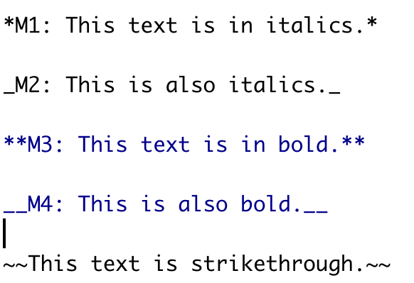

class:inverse, middle center bg-main1

# <span style="color:#ffc403">Packages</span> 

## `install.packages("rmarkdown")`

## `install.packages("knitr")`


--

```{r, echo=FALSE}
anicon::faa("bell", animate="ring", size=5)
```

## <span style="color:#ffc403">Additional packages</span>

## `install.packages("tidyverse")`

---
background-image:url("communicate.png")
background-size: contain
---
background-image:url("screenshots/1img.png")
background-size: contain

---
background-image:url("screenshots/2img.png")
background-size: contain

---
background-image:url("screenshots/3img.png")
background-size: contain

---
background-image:url("screenshots/4img.png")
background-size: contain
---
background-image:url("screenshots/5img.png")
background-size: contain
---
background-image:url("screenshots/6img.png")
background-size: contain
---
background-image:url("screenshots/7img.png")
background-size: contain
---
background-image:url("screenshots/8img.png")
background-size: contain
---
background-image:url("screenshots/9img.png")
background-size: contain

---
background-image:url("screenshots/10img.png")
background-size: contain

---
background-image:url("screenshots/11img.png")
background-size: contain

---
background-image:url("screenshots/12img.png")
background-size: contain

---
background-image:url("screenshots/13img.png")
background-size: contain

---
background-image:url("screenshots/14img.png")
background-size: contain

---

class: middle center bg-main1

```{r, echo=FALSE}
anicon::faa("wrench", size=5)
```

# Creating an R Markdown document

---

background-image: url(rmarkdown_step1.png)
background-position: center
background-size: contain


---
background-image: url(rmarkdown_step2.png)
background-position: center
background-size: contain

---

background-image: url(rmarkdown_step2_1.png)
background-position: center
background-size: contain
---
class: inverse, center, middle

# Demonstration

---

<iframe width="1100" height="580" src="https://www.youtube.com/embed/I7gBVvnm2Xg" title="YouTube video player" frameborder="0" allow="accelerometer; autoplay; clipboard-write; encrypted-media; gyroscope; picture-in-picture" allowfullscreen></iframe>

---


class: middle center bg-main1

```{r, echo=FALSE}
anicon::faa("leaf", animate="spin", size=5)
```

# Customizing your R Markdown document: text


---
background-image:url("sc1/c1.png")
background-size:contain

---

background-image:url("sc1/c2.png")
background-size:contain

---

background-image:url("sc1/c3.png")
background-size:contain

---

background-image:url("sc1/c4.png")
background-size:contain

---
background-image:url("sc1/c5.png")
background-size:contain

---

background-image:url("sc1/c6.png")
background-size:contain

---

background-image:url("sc1/c7.png")
background-size:contain

---

background-image:url("sc1/c8.png")
background-size:contain

---

background-image:url("sc1/c9.png")
background-size:contain

---

background-image:url("sc1/c13.png")
background-size:contain

---

background-image:url("sc1/c14.png")
background-size:contain

---

background-image:url("sc1/c15.png")
background-size:contain


---

# Change Header

.pull-left[

**Code**

```r

# Header 1

## Header 2

### Header 3

```

]

.pull-right[

**Output**


# Header 1

## Header 2

### Header 3


]

---

# Add content

.pull-left[

**Code**

```r

# Header 1

This is section 1.

## Header 2

This is section 1.2

### Header 3

This is section 1.2.1

```

]

.pull-right[

**Output**


# Header 1

This is section 1.

## Header 2

This is section 1.2

### Header 3

This is section 1.2.1


]

---

# Text formatting

.pull-left[

## Code




]

.pull-right[

## Output

*M1: This text is in italics.*

_M2: This is also italics._

**M3: This text is in bold.**

__M4: This is also bold.__


~~This text is strikethrough.~~

]


---

class: middle center bg-main1

```{r, echo=FALSE}
anicon::faa("align-center", animate="pulse", size=5)
```

# Include R codes

---

background-image:url("sc1/c17.png")
background-size:contain


---
class: middle center bg-main1

`r anicon::faa('exclamation-triangle', animate='flash', size=7)`

# Anatomy of R Markdown


---

class: middle center bg-main1


# Anatomy of R Markdown

## code chunk

---


background-image:url("sc1/c18.png")
background-size:contain

---

class: middle center bg-main1


# Anatomy of R Markdown

## Text

---

background-image:url("sc1/c20.png")
background-size:contain

---

class: middle center bg-main1

# Anatomy of R Markdown

## YAML

### HTML Document

---

background-image:url("sc1/c19.png")
background-size:contain

---

class: middle center bg-main1

# Anatomy of R Markdown

## YAML

### PDF Document


---

background-image:url("sc1/SC/s1.png")
background-size:contain

---

background-image:url("sc1/SC/s2.png")
background-size:contain

---

class: middle center bg-main1

# Anatomy of R Markdown

## YAML

### Word Document


---

background-image:url("sc1/SC/s3.png")
background-size:contain

---

background-image:url("sc1/SC/s4.png")
background-size:contain

---

class: middle center bg-main1

`r anicon::faa('exclamation-circle', animate='bounce', size=7)`

# Chunk options

---

background-image:url("sc1/SC/s5.png")
background-size:contain

## fig.width/ fig.height

---
background-image:url("sc1/SC/s7.png")
background-size:contain

## fig.width/ fig.height

---

background-image:url("sc1/SC/s6.png")
background-size:contain

## echo [TRUE/ FALSE]


---

background-image:url("sc1/SC/s8.png")
background-size:contain

## eval [TRUE/ FALSE]

---
class: bg-main1

# Chunk options

* `eval = FALSE` - prevent the code from being evaluated

* `include = FALSE` - run the code but doesn't show it in the final document

* `echo = FALSE` - prevent the code but not the results from appearing

* `message = FALSE` - prevent messages from appearing in the finished file

* `results = "hide"` - hide the printed output

* `error = TRUE` - cause the render to continue even if the code returns an error

* `comment=NA` - remove # from the  output

--

.pull-left[

Without `comment=NA`

```{r}
a <- 1:5; a
```

]

.pull-right[

With `comment=NA`

```{r, comment=NA}
a <- 1:5; a
```


]

---

class: middle center bg-main1

# Thank you


`r anicon::faa('angellist', animate='shake', size=5)`

## `r anicon::nia("Make some VOICE using R Makrkdown!", size=9)`

Additional Resources [https://talks-thiyanga.netlify.app/rmarkdown_rladies/rmarkdownrladies_tst#1](https://talks-thiyanga.netlify.app/rmarkdown_rladies/rmarkdownrladies_tst#1) 

<a rel="license" href="http://creativecommons.org/licenses/by-sa/4.0/"></a><br />This work is licensed under a <a rel="license" href="http://creativecommons.org/licenses/by-sa/4.0/">Creative Commons Attribution-ShareAlike 4.0 International License</a>.


