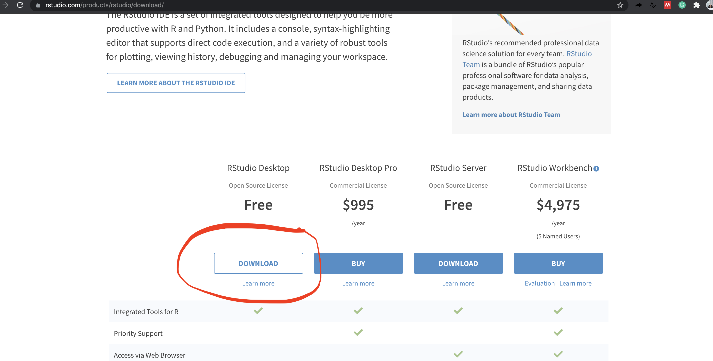

<style type="text/css">
  body{
  font-size: 15pt;
}
</style>

```{css, echo = FALSE}
h1, #TOC>ul>li {
  color: #66a61e;
  font-weight: bold;
}

h2, #TOC>ul>ul>li {
  color: #e7298a;
  #font-family:  "Times";
  font-weight: bold;
}

h3, #TOC>ul>ul>li {
  color: #7570b3;
  #font-family:  "Times";
  font-weight: bold;
}
```

```{r setup, include=FALSE}
knitr::opts_chunk$set(echo = TRUE)
```

#  Install R and RStudio on Mac 

## 1. Download and install R

### Step 1.1

- Open an internet browser and go to https://cran.r-project.org./

- Click on the **Download R for macOS** link.


### Step 1.2

Click on the link for the pkg file of the latest R version and save it.


### Step 1.3

Double click the downloaded file and follow installation instructions on the screen. When installing, you can probably just accept the default settings by clicking 'Next'.

Note that without	installing R,	you	will	not	be	able	to	install RStudio and additional packages	later. If you want to watch a step-by-step tutorial on how to install R for macOS, you can watch these video here: https://www.youtube.com/watch?v=uxuuWXU-7UQ


## 2. Download and install R Studio

### Step 2.1

Go to: https://www.rstudio.com/products/rstudio/download/ and click	on	the	“DOWNLOAD”	button.



### Step 2.2

Click	on	“DOWNLOAD RSTUDIO FOR MAC”.


### Step 2.3

Save the .dmg file on your computer, double-click it, and then drag and drop it to your applications folder.

Remember, you must have R already installed before installing Rstudio. 


## 3. To check if the installation is successful

### Step 3.1

Open	RStudio by clicking the RStudio icon. Once you have RStudio opened, there should be several “windows”.

### Step 3.2

Go to the window named “Console” and type `1+3` and press enter as shown below. An	output line	reading	**`[1] 3`** should	appear.	This	means	that	R	and	RStudio	are	working.


Step-by-step video clip is available at https://www.youtube.com/watch?v=6iT6vfh8uhQ