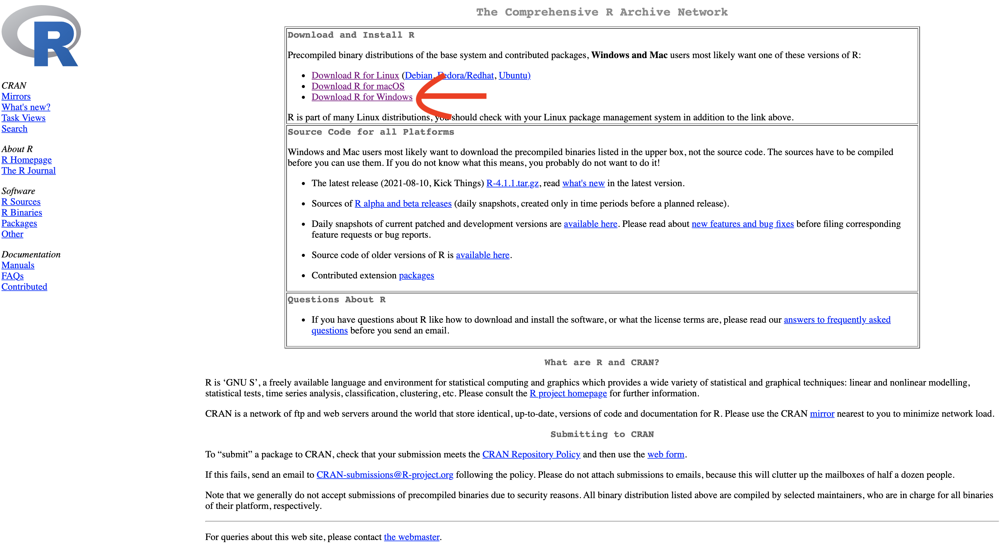
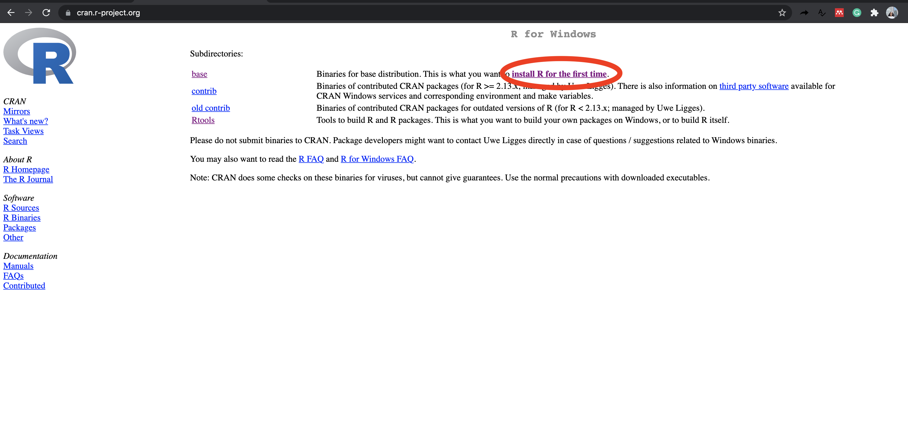
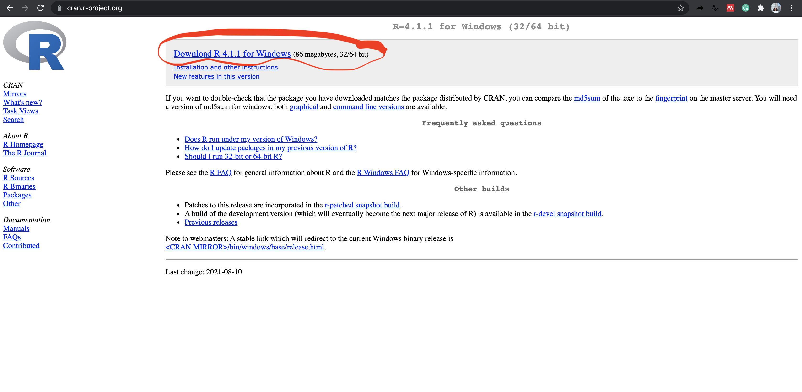
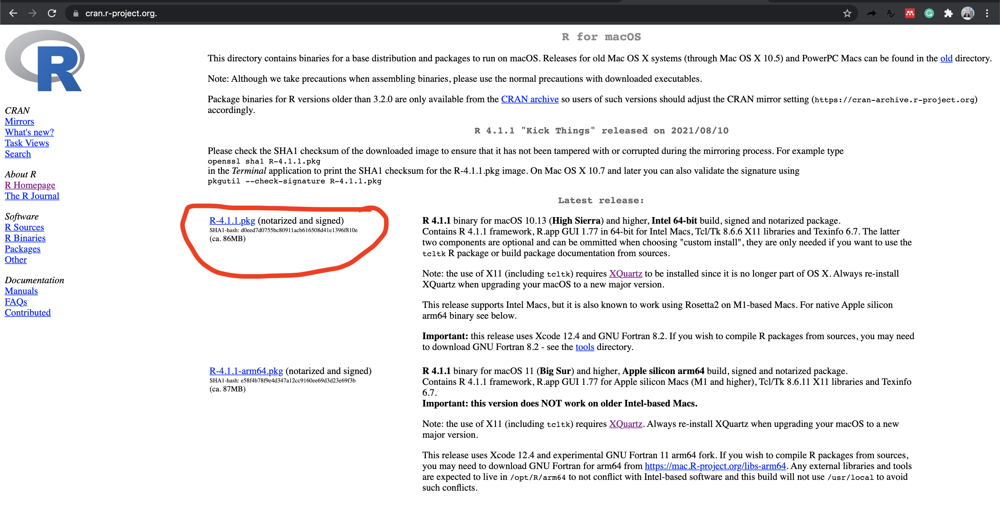
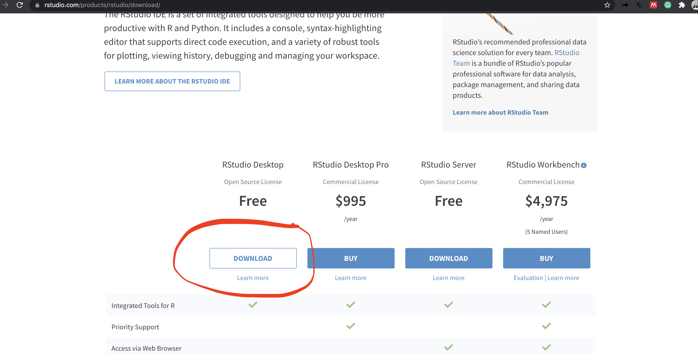
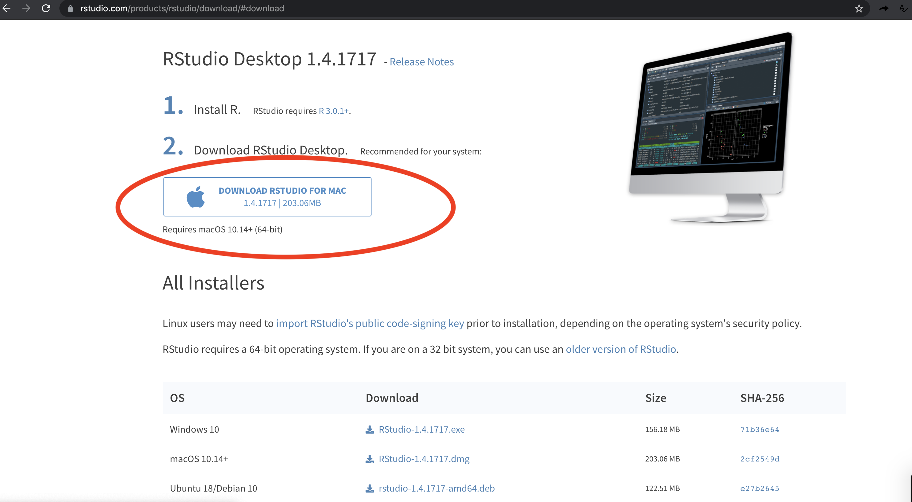

```{r setup, include=FALSE}
knitr::opts_chunk$set(echo = TRUE)
```

# 🖥️ Install R and RStudio on Windows

## Download and install R

#### Step 1

- Open an internet browser and go to https://cran.r-project.org./

- Click on the **Download R for Windows** link.




#### Step 2

Click on the base subdirectory link or install R for the first time link.



#### Step 3

Click, **Download R X.X.X for Windows** (X.X.X stand for the latest version of R. eg: 4.1.1). At the moment of writing (16 August 2021), R 4.1.1 is the latest version. Choose the most recent one. 

This save the executable .exe file.




### Step 4

Run the `.exe` file and follow the installation instructions. Default	settings	are	fine. Without	installing R,	you	will	not	be	able	to	install RStudio and 	additional packages	later.

If you want to watch a step-by-step tutorial on how to install R for Windows, you can watch these video here: https://www.youtube.com/watch?v=Ohnk9hcxf9M

## Download and install R Studio

### Step 1

Go to: https://www.rstudio.com/products/rstudio/download/

### Step 2

Remember, you must have R already installed before installing Rstudio. 

#  Install R and RStudio on Mac 

## Download and install R

#### Step 1

- Open an internet browser and go to https://cran.r-project.org./

- Click on the **Download R for macOS** link.


#### Step 2

Click on the link for the pkg file of the latest R version and save it.



#### Step 3

Double click the downloaded file and follow installation instructions on the screen.

If you want to watch a step-by-step tutorial on how to install R for Windows, you can watch these video here: https://www.youtube.com/watch?v=uxuuWXU-7UQ


## Download and install R Studio

### Step 1

Go to: https://www.rstudio.com/products/rstudio/download/ and click	on	the	“DOWNLOAD”	button.



### Step 2

Click	on	“DOWNLOAD RSTUDIO FOR MAC”.




### Step 3

Save the .dmg file on your computer, double-click it, and then drag and drop it to your
applications folder.

Remember, you must have R already installed before installing Rstudio. 
