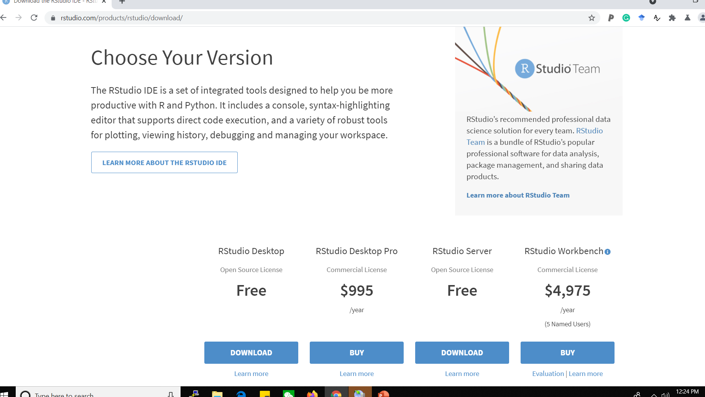
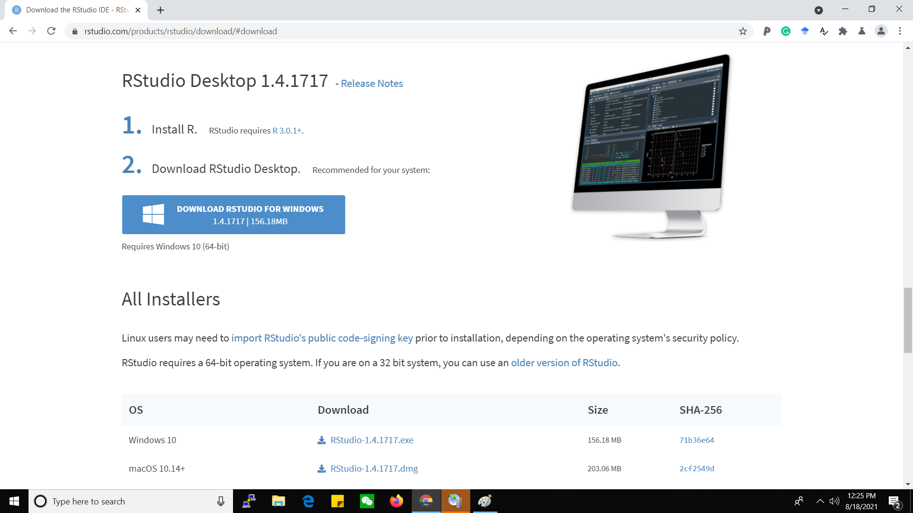
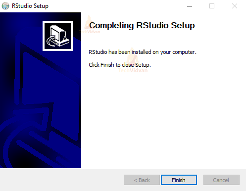
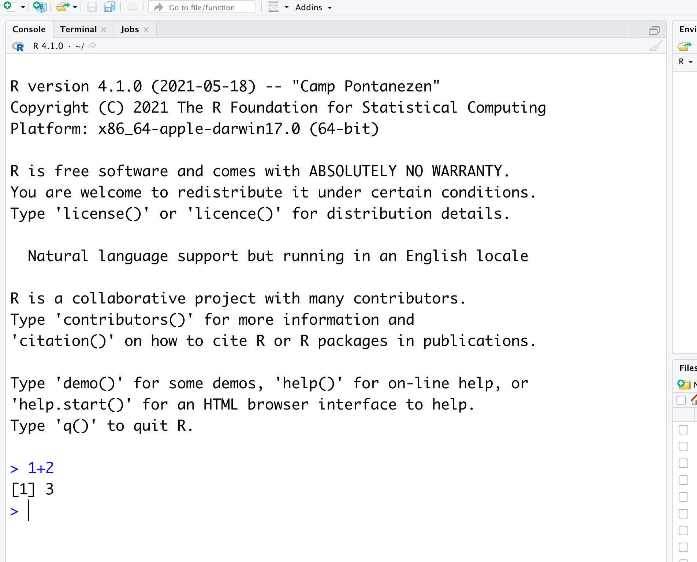

<style type="text/css">
  body{
  font-size: 15pt;
}
</style>

```{css, echo = FALSE}
h1, #TOC>ul>li {
  color: #66a61e;
  font-weight: bold;
}

h2, #TOC>ul>ul>li {
  color: #e7298a;
  #font-family:  "Times";
  font-weight: bold;
}

h3, #TOC>ul>ul>li {
  color: #7570b3;
  #font-family:  "Times";
  font-weight: bold;
}
```

```{r setup, include=FALSE}
knitr::opts_chunk$set(echo = TRUE)
```

# 🖥️  Install R and RStudio on Windows

## 1. Download and install R

### Step 1.1

- Open an internet browser and go to https://cran.r-project.org./

- Click on the **Download R for Windows** link.


### Step 1.2

Click on install R for the first time link.


### Step 1.3

Click, **Download R X.X.X for Windows** (X.X.X stand for the latest version of R. eg: 4.1.1). At the moment of writing (16 August 2021), R 4.1.1 is the latest version. Choose the most recent one. This saves the executable .exe file.


### Step 1.4

Run the `.exe` file and follow the installation instructions on the screen. Run the `.exe` file with the default settings by clicking 'Next'. 

Note that without	installing R,	you	will	not	be	able	to	install RStudio and additional packages	later. If you want to watch a step-by-step tutorial on how to install R for Windows, you can watch the video here: https://www.youtube.com/watch?v=Ohnk9hcxf9M

## 2. Download and install R Studio

### Step 2.1

Go to: https://www.rstudio.com/products/rstudio/download/ and click	on	the	“DOWNLOAD”	button.




### Step 2.2

Click	on	“DOWNLOAD RSTUDIO FOR WINDOWS”.




### Step 2.3

Next, double click the downloaded file. This will start the install process.  Click next to continue when the install wizard opens. Continue next until the installation process takes place:




## 3. To check if the installation is successful

### Step 3.1

Open	RStudio by clicking the RStudio icon. Once you have RStudio opened, there should be several “windows”.

### Step 3.2

Go to the window named “Console” and type `1+2` and press enter as shown below. An	output line	reading	**`[1] 3`** should	appear.	This	means	that	R	and	RStudio	are	working.




Step-by-step video clip is available at https://www.youtube.com/watch?v=6iT6vfh8uhQ. 