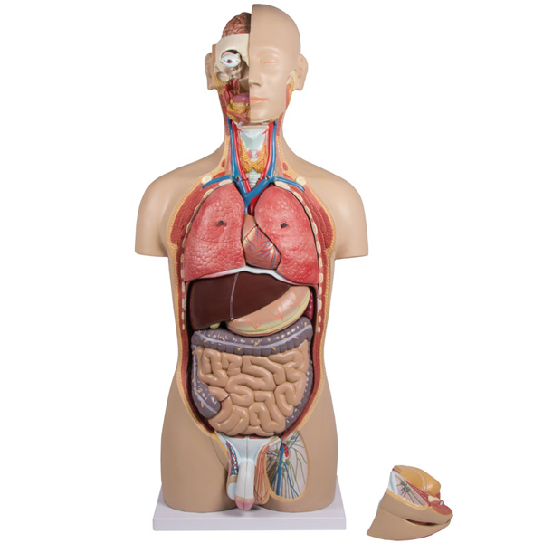
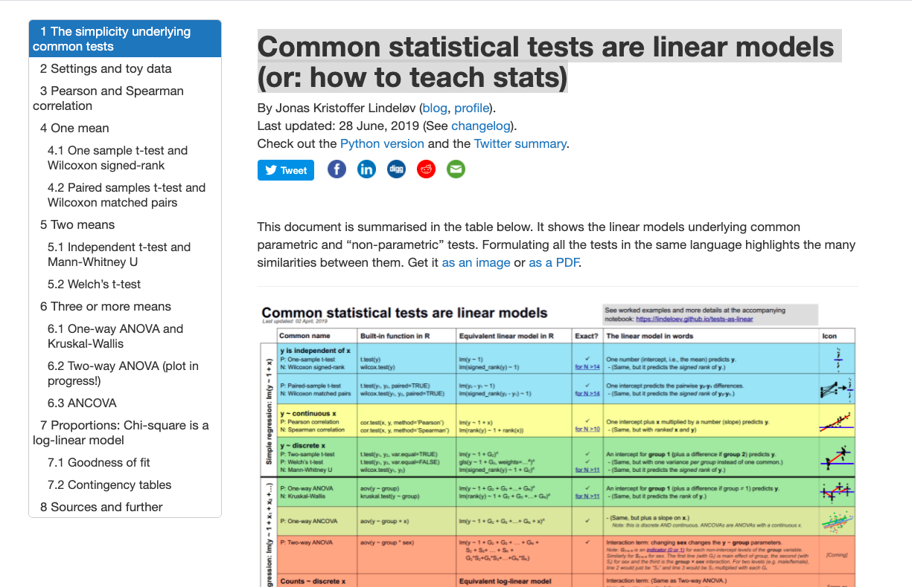
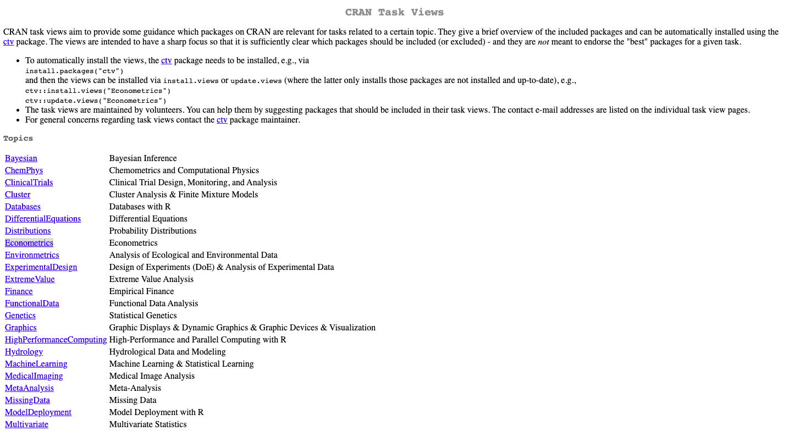

background-image:url('fig/tidyworkflow1.png')
background-position: 50% 80%
background-size: 85%
class: top, center
# Tidy Workflow

```{r setup, include=FALSE}
library(knitr)
options(htmltools.dir.version = FALSE)
opts_chunk$set(
  warning = FALSE,
  message = FALSE,
  echo = FALSE,
  cache.path = 'cache/',
  fig.align = 'center',
  cache = TRUE
)

library(tidyverse)
library(patchwork)
library(palmerpenguins)

```


```{css, echo=FALSE}
/* custom.css */
.left-code {
  color: #777;
  width: 38%;
  height: 92%;
  float: left;
}
.right-plot {
  width: 60%;
  float: right;
  padding-left: 1%;
}
.plot-callout {
  height: 225px;
  width: 450px;
  bottom: 5%;
  right: 5%;
  position: absolute;
  padding: 0px;
  z-index: 100;
}
.plot-callout img {
  width: 100%;
  border: 4px solid #23373B;
}
```


```{r xaringan-themer, include=FALSE, warning=FALSE}
library(xaringanthemer)
style_mono_accent(
   base_color = "#002c54",
   title_slide_background_color = "#03420e",
  inverse_background_color = "#002c54",
  header_font_google = google_font("Josefin Sans"),
  text_font_google   = google_font("Montserrat", "300", "300i"),
  code_font_google   = google_font("Fira Mono"),
  title_slide_text_color = "#ffea00",
  inverse_header_color = "#ffea00",
   header_background_text_color = "#ffea00",
   text_font_size = "1.4rem",
  )
```


---

background-image:url('fig/tidyworkflow1a.png')
background-position: 50% 80%
background-size: 85%
class: top, center
# Tidy Workflow
---

background-image:url('fig/tidyworkflow1b.png')
background-position: 50% 80%
background-size: 85%
class: top, center
# Tidy Workflow
---
class: inverse, center, middle

# What is the purpose of a model?
--

# How can I fit models in R?

---
class: inverse, center, middle

# What is a Model?

---


.pull-left[
### What is a Model?

```{r model1, out.width="50%"}


```

```{r}


```


].pull-right[

```{r}

```

```{r model4, out.width="60%"}


```


]


---

class: inverse, center, middle

# What is a Model?
--

## An <span style="color:#06c280">Approximation</span> of reality
--

## ... with a <span style="color:#06c280">purpose</span>

---

.pull-left[

```{r }

new_penguins <- penguins %>%
    filter(complete.cases(flipper_length_mm, body_mass_g, species, sex))

p<- ggplot(new_penguins, aes(x = body_mass_g, y = flipper_length_mm)) +
    geom_point() +
    geom_smooth(method = "lm", formula = y ~ x,
                col = "red", se = FALSE)
print(p)
```
].pull-right[

```{r}
p<- ggplot(new_penguins, aes(x = body_mass_g, y = flipper_length_mm, 
                         col = species)) +
    geom_point(size = 2, alpha = 0.5) + 
    geom_smooth(method = "loess", formula = y ~ x, 
                se = FALSE, size = 1.5) +
    facet_grid(~ sex) +
    theme_bw() + 
    labs(title = "Flipper Length and Body Mass, by Gender & Species",
         subtitle = paste0(nrow(new_penguins), " of the Palmer Penguins"),
         x = "Body Mass (g)", 
         y = "Flipper Length (mm)")

print(p)
```

]
---
class: inverse, center, middle

# What is the purpose of  a statistical Model?


---
## What is the purpose of  a statistical Model?

- Separate **signal** from **noise**

- Understand **trends** and **patterns**

- Identify which variables are **related** to a response variable

  - Quantify this relationship

- Make **predictions** about future observations

- Understand underlying **unexplained variability** in the patterns

- **Compare results** against other statistical models
---
background-image:url('fig/2_box.jpeg')
background-position: 50% 80%
background-size: 85%
class: top, center, inverse

---

.pull-left[

```{r echo=TRUE, out.width="100%"}
set.seed(4343)
data <- tibble(x = rnorm(1000,0,10),
               y = -(3*x^2) + 
                 rnorm(100, 0, 45))
data1 <- data %>% 
  filter(x<=-4)

model1 <- lm(y ~x, data = data1)
summary(model1)
```
].pull-right[


```{r}
set.seed(4343)
x <- rnorm(1000,0,10) 
y <- -(3*x^2) + rnorm(100, 0, 45)
data <- tibble(x, y)

data1 <- data %>%
  filter(x<=-4)

cor_xy <- round(cor(data1$x, data1$y),3)
p <- ggplot(data1, aes(x,y))+
  geom_point()+
  geom_smooth(method = "lm", formula = y ~ x,
                col = "red", se = FALSE)+
  theme(aspect.ratio = 1) +
  ggtitle(paste("Correlation =", cor_xy, ")"))+
    xlim(-17,16) +
  ylim(-733.30199  , 150.10519)

print(p) 

```
]

---


.pull-left[

```{r echo=TRUE, out.width="100%"}
set.seed(4343)
data <- tibble(x = rnorm(1000,0,10),
               y = -(3*x^2) + rnorm(100, 0, 45))
data1 <- data %>% filter(x<=-4)
model1 <- lm(y ~x, data = data1)
summary(model1)
```
].pull-right[


```{r}
set.seed(4343)
x <- rnorm(1000,0,10) 
y <- -(3*x^2) + rnorm(100, 0, 45)
data <- tibble(x, y)

data1 <- data %>%
  filter(x<=-4)

cor_xy <- round(cor(data1$x, data1$y),3)
p <- ggplot(data, aes(x,y))+
  geom_point()+
  geom_smooth(method = "lm", formula = y ~ x,
                col = "red", se = FALSE, data = data1)+
  theme(aspect.ratio = 1) +
  ggtitle(paste("Correlation =", cor_xy, ")"))+
    xlim(-17,16) +
  ylim(-733.30199  , 150.10519)
print(p) 

```
]


---
.pull-left[

```{r echo=TRUE, out.width="100%"}
set.seed(4343)
data <- tibble(x = rnorm(1000,0,10),
               y = -(3*x^2) + rnorm(100, 0, 45))
model2 <- lm(y ~x, data = data)
summary(model2)
```
].pull-right[

```{r}
set.seed(4343)
data <- tibble(x = rnorm(1000,0,10),
               y = -(3*x^2) + rnorm(100, 0, 45))
cor_xy2 <- round(cor(data$x, data$y),3)
p <- ggplot(data, aes(x,y))+
  geom_point()+
  geom_smooth(method = "lm", formula = y ~ x,
                col = "red", se = FALSE)+
  theme(aspect.ratio = 1) +
  theme(aspect.ratio = 1) +
  xlim(-17,16) +
  ylim(-733.30199  , 72.10519)+
  ggtitle(paste("Correlation =", cor_xy2, ")"))+
    xlim(-17,16) +
  ylim(-733.30199  , 150.10519)

print(p)
```
]

---

.pull-left[

```{r echo=TRUE, out.width="100%"}
set.seed(4343)
data <- tibble(x = rnorm(1000,0,10),
               y = -(3*x^2) + rnorm(100, 0, 45))
model2 <- lm(y ~ poly(x,2), data = data)
summary(model2)
```
].pull-right[

```{r}
set.seed(4343)
data <- tibble(x = rnorm(1000,0,10),
               y = -(3*x^2) + rnorm(100, 0, 45))
cor_xy2 <- round(cor(data$x, data$y),3)
p <- ggplot(data, aes(x,y))+
  geom_point()+
  geom_smooth(method = "lm", formula = y ~ poly(x,2),
                col = "red", se = FALSE)+
  theme(aspect.ratio = 1) +
  theme(aspect.ratio = 1) +
  xlim(-17,16) +
  ylim(-733.30199  , 72.10519)+
  ggtitle(paste("Correlation =", cor_xy2, ")"))+
    xlim(-17,16) +
  ylim(-733.30199  , 150.10519)

print(p)
```
]

---

```{r fig.width=15}
set.seed(4343)
data <- tibble(x = rnorm(1000,0,10),
               y = -(3*x^2) + rnorm(100, 0, 45))
cor_xy2 <- round(cor(data$x, data$y),3)
p <- ggplot(data, aes(x,y))+
  geom_point()+
  geom_line(colour = "blue")+
  xlim(-17,16) +
  ylim(-733.30199  , 72.10519)+
  ggtitle(paste("Correlation =", cor_xy2, ")"))+
    xlim(-17,16) +
  ylim(-733.30199  , 150.10519)

print(p)
```


---

class: inverse, center, middle

# Modelling in R

---


.pull-left[
# Modelling in R

**Explore data** using ggplot before modelling


```
ggplot(...) +
 geom_point(...) +
 geom_smooth(...)

```

```{r echo=TRUE, eval=FALSE}
ggplot(data, aes(x,y))+
  geom_point() +
  geom_smooth(method = "lm", 
              formula = y ~ x, #<<
              col = "blue", se = FALSE) +
  geom_smooth(method = "lm", 
              formula = y ~ poly(x,2), #<<
              col = "red", se = FALSE) + 
  theme(aspect.ratio = 1) 
```

]
.pull-right[


```{r }
set.seed(4343)
data <- tibble(x = rnorm(1000,0,10),
               y = -(3*x^2) + rnorm(100, 0, 45))
p <- ggplot(data, aes(x,y))+
  geom_point()+
  geom_smooth(method = "lm", 
              formula = y ~ poly(x,2),
              col = "red", se = FALSE) +
  geom_smooth(method = "lm", 
              formula = y ~ x,
              col = "blue", se = FALSE) +
  theme(aspect.ratio = 1) +
  xlim(-17,16) +
  ylim(-733.30199  , 150.10519)

print(p)
```


]

---

.pull-left[
- The linear model function

 `lm(y ~ x, data)`
 
 
- Assign the linear model to be an **object**

 `model <- lm(y ~ x, data)`
 
```{r echo=TRUE, eval=FALSE}

model1 <- lm(
  body_mass_g ~ flipper_length_mm, #<<
  data = penguins)
```

].pull-right[


```{r}
ggplot(penguins, aes(x = flipper_length_mm, y = body_mass_g)) +
    geom_point() +
    geom_smooth(method = "lm", formula = y ~ x,
                col = "red", se = FALSE)
```
]


---


.left-code[
- The linear model function

 `lm(y ~ x, data)`
 
 
- Assign the linear model to be an **object**


`model <- lm(y ~ x,`
`            data)`

 
```{r echo=TRUE, eval=FALSE}

model1 <- lm(
  body_mass_g ~ flipper_length_mm, 
  data = penguins)
summary(model1) #<<
```

]

.right-plot[

```{r out.width=3, comment=NA}

model1 <- lm(
  flipper_length_mm ~ body_mass_g, 
  data = penguins)
summary(model1)
```
]


<!-- residuals Chapter 12 Fitting Regression Models in R _ Biology 723_ Statistical Computing for Biologists.pdf-->


<!--- The data structure returned by `lm()` is a list-like object with multiple fields:-->
--

.left-code[

```{r echo=TRUE}
typeof(model1)
```
]

<!--  carries lots of useful information it isn???t a particularly ???tidy??? way to access the data. -->

<!--
- The R package Broom converts statistical analysis objects from R into **tidy data frames**, so that they can more easily be combined, reshaped and otherwise processed with tools like `dplyr`, `tidyr` and `ggplot2`. 
-->

---
class: inverse, middle, center

# broom 

## let's tidy up a bit

```{r out.width="30%"}


```

---
## `Broom` Toolkit

- The `broom` package takes the **messy output** of built-in functions in R, such as `lm`,  `t.test`, and turns them into tidy **tibbles**.

- This package provides three methods that do three distinct kinds of tidying.

     - `tidy` 
     - `augment`
     - `glance`

---

## `broom::tidy`

- Returns the statistical findings of the model 

- This includes coefficients and p-values for each term in a regression

 
```{r echo=TRUE, eval=FALSE}
library(broom)

model1 <- lm( body_mass_g ~ flipper_length_mm, data = penguins)

tidy(model1) #<<
```


```{r out.width=3, comment=NA}
library(broom)

model1 <- lm(
  body_mass_g ~ flipper_length_mm, 
  data = penguins)

tidy(model1) 
```


---
## `broom::augment`

<!--
https://cran.r-project.org/web/packages/broom/vignettes/broom.html

Instead of viewing the coefficients, you might be interested in the fitted values and residuals for each of the original points in the regression. For this, use augment, which augments the original data with information from the model:
-->

-  Add columns to the original data that was modeled.

- This includes predictions, residuals, and cluster assignments.

 
```{r echo=TRUE, eval=FALSE}
library(broom)

model1 <- lm( body_mass_g ~ flipper_length_mm, data = penguins)

augment(model1) #<<
```


```{r out.width=3, comment=NA}
model1 <- lm(
  body_mass_g ~ flipper_length_mm, 
  data = penguins)
augment(model1) 
```


<!--
augment creates a data frame that combines the original data with related information from the model
fit.

Now, in addition to the proportionBlack and ageInYears variables of the original data, we have columns like .fitted (value of Y predicted by the model for the corresponding value of X), .resid (difference between the actual Y and the predicted value), and a variety of other information for evalulating model uncertainty.

One thing we can do with this ???augmented??? data frame is to use it to better visualize and explore the model. For example, if we wanted to generate a figure highlighting the deviations from the model using vertical lines emanating from the regression line, we could do something like this:

-->
---

## Plotting Augmented Data
<!--One thing we can do with this ???augmented??? data frame is to use it to better visualize and explore the model. For example, if we wanted to generate a figure highlighting the deviations from the model using vertical lines emanating from the regression line, we could do something like this

-->


.pull-left[

```{r echo=TRUE, eval=FALSE}

model1 <- lm(
  body_mass_g ~ flipper_length_mm, 
  data = penguins)

mod1_arg <- augment(model1) #<<

mod1_arg %>%
  ggplot( aes(flipper_length_mm, .resid)) +
  geom_point() +
  geom_hline(yintercept = 0, 
             color = "red",
             linetype='dashed') +
  labs(y = "Residuals",
       title = "Residual plot")
```

]

.pull-right[

```{r}
library(broom)
model1 <- lm(
  body_mass_g ~ flipper_length_mm, 
  data = penguins)

mod1_arg <- augment(model1) #<<

p<- mod1_arg %>%
  ggplot( aes(flipper_length_mm, .resid)) +
  geom_point() +
  geom_hline(yintercept = 0, 
             color = "red",
             linetype='dashed') +
  labs(y = "Residuals",
       title = "Residual plot") 

print(p)
```
]

---
## Plotting Augmented Data: qq-plots
<!--
From our residuals plot of the lions data set, there may be some indication of greater variance of residuals for larger values of the predictor variable.
Let???s check how normal the residuals look using a diagnostic plot called a QQ-plot (quantile-quantile plot). A qq-plot is a graphical method for comparing distributions by plotting the respective quantiles against each other. Typically we plot sample quantiles against theoretical quantiles; for example to compare the sample quantiles to the theoretical expectation of normality. In the example below we construct the QQ-plot using ???standardized residuals??? from the regression which are just z-scores for the residuals.-->


.pull-left[

```{r echo=TRUE, eval=FALSE}

model1 <- lm(
  body_mass_g ~ flipper_length_mm, 
  data = penguins)

mod1_arg <- augment(model1) 

mod1_arg %>%
  ggplot(aes(sample = .std.resid)) + #<<
  geom_qq() + #<<
  geom_qq_line(color="firebrick") #<<
```

]

.pull-right[

```{r}
library(broom)
model1 <- lm(
  body_mass_g ~ flipper_length_mm, 
  data = penguins)

mod1_arg <- augment(model1) #<<

p<- mod1_arg %>%
  ggplot(aes(sample = .std.resid)) +
  geom_qq() +
  geom_qq_line(color="firebrick")

print(p)
```

]


<!-- Based on the QQ-plot, the residuals seem to diverge somewhat from a normal distirbution, as there???s noticeable curvature in the QQ-plot. When we test for the normality of the residuals using Shapiro- Wilk???s test for normality, we fail to reject the null hypothesis of normality at a significance threshold of
:-->

---
## `broom::glance`

<!--
https://cran.r-project.org/web/packages/broom/vignettes/broom.html

Finally, several summary statistics are computed for the entire regression, such as R^2 and the F-statistic. These can be accessed with the glance function:
-->

-  Returns a concise one-row summary of the model.

- This typically contains values such as $R^2$, adjusted $R^2$, and residual standard error that are computed once for the entire model.

 
```{r echo=TRUE, eval=FALSE}
library(broom)

model1 <- lm( body_mass_g ~ flipper_length_mm, data = penguins)

glance(model1) #<<
```


```{r out.width=3, comment=NA}
model1 <- lm(
  body_mass_g ~ flipper_length_mm, 
  data = penguins)
glance(model1) 
```

---
# Multiple regression

Multiple regression is also possible using the same function

## `lm(y ~ x, data)`
 
--
 
## `lm(y ~ x1 + x2, data)`

--

## `lm(y ~ x1 * x2, data)`

---


Similarly, **transformations** are also quite easy to apply

## `lm(log(y) ~ x, data)`

--


## `lm(y ~ log(x), data)`

--


## `lm(y ~ poly(x, 2), data)`

---
##  What about all the other kinds of model?

.pull-left[
### Analysis of Variance 

## `lm(y ~ x, data)`

X is **categorical**

].pull-right[

### Linear Regression
## `lm(y ~ x, data)`

X is **numerical**
]

---

### Common statistical tests are linear models (or: how to teach stats): https://lindeloev.github.io/tests-as-linear/


```{r lm, out.width="100%"}


```


---

# Other kinds of models

- **Not all** tests are linear models

- For **non-normal** distributions of residuals, we have **generalised linear model**

## `glm(y ~ x, data, family = "")`


```
glm(y ~ x, data, family = "binomial")

glm(y ~ x, data, family = "poisson")

glm(y ~ x, data, family = "Gamma")
```

---
## CRAN Task Views

- The CRAN task view provides an overview of the packages available for **various research fields** and **methodologies**

https://cran.r-project.org/web/views/

```{r ctv, out.width="100%"}


```

---
# Key points


- **Know your data** - explore it before jumping into a formal model.

- If exploration brings up something interesting or unexpected, try to **incorporate this** into the model.

- Always consider the **trade-off** between something which is over-simplified and something which is over-complicated.

---
class: inverse, middle, center


```{r}
icon::fa("github")
icon::fa("twitter")

```
pridiltal and thiyangt


This work was supported in part by RETINA research lab funded by the OWSD, a program unit of United Nations Educational, Scientific and Cultural Organization (UNESCO).


All rights reserved by Thiyanga S. Talagala and Priyanga D. Talagala


<!--https://www.r-bloggers.com/2020/07/basic-data-analysis-with-palmerpenguins/ -->