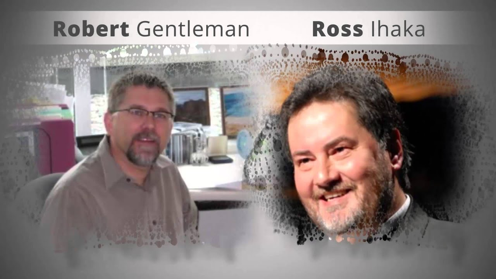
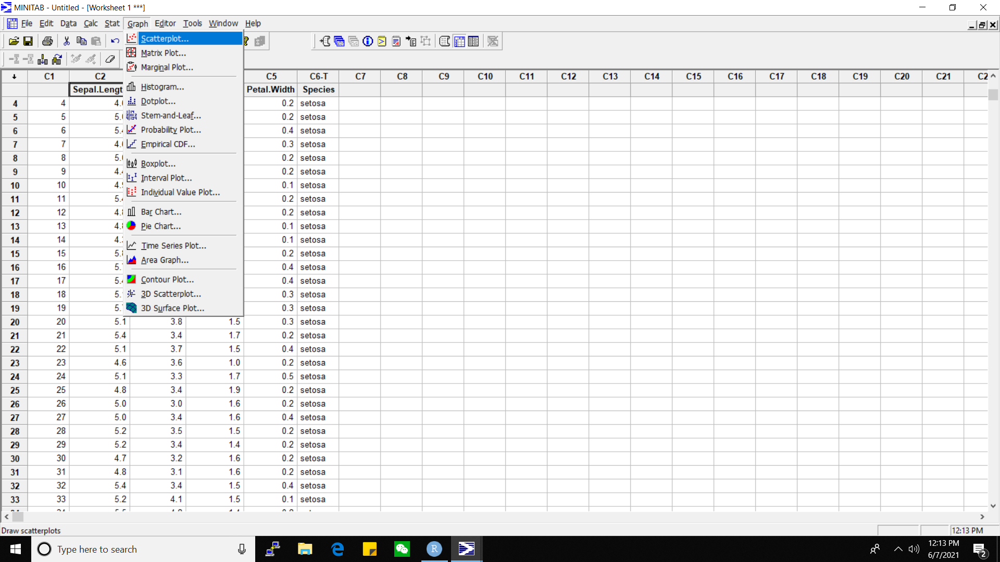
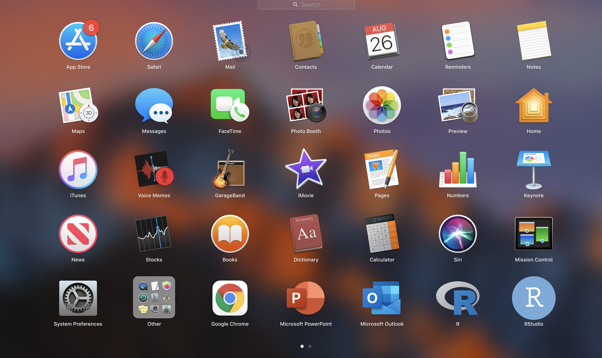
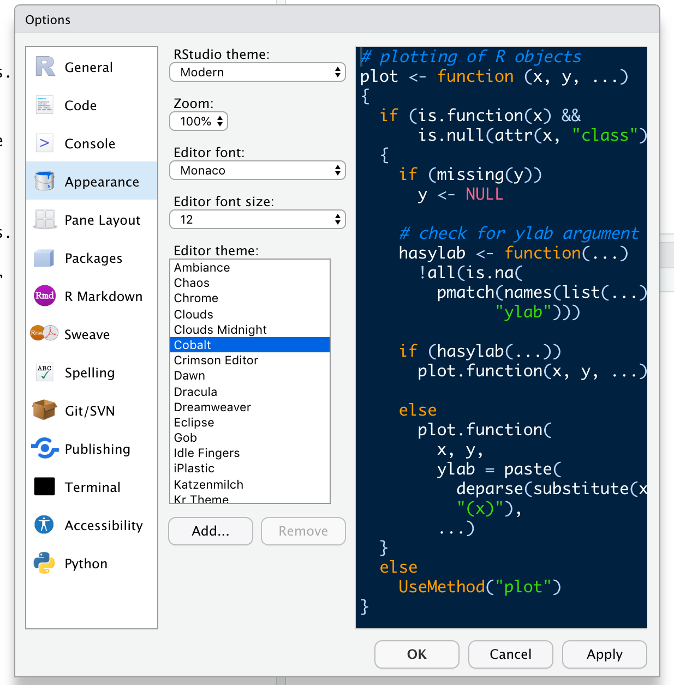
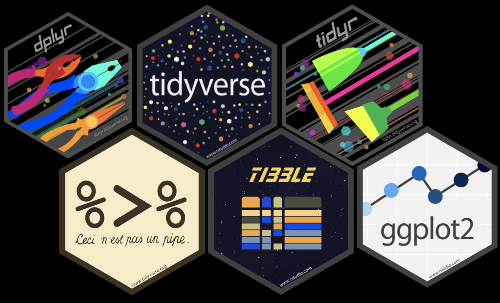
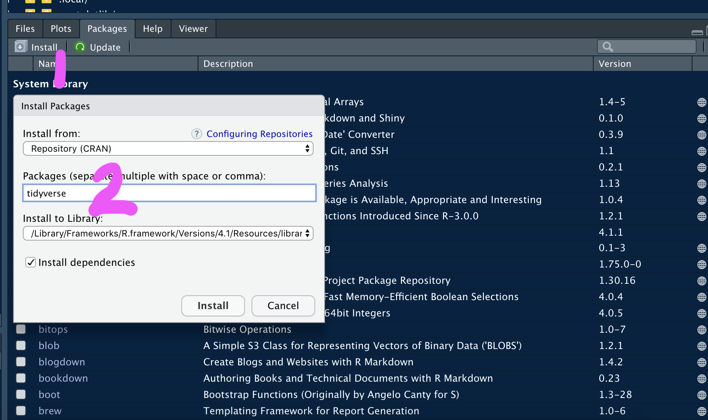

```{r setup, include=FALSE}
options(htmltools.dir.version = FALSE)
knitr::opts_chunk$set(
  fig.width=9, fig.height=3.5, fig.retina=3,
  out.width = "100%",
  cache = FALSE,
  echo = TRUE,
  message = FALSE, 
  warning = FALSE,
  fig.show = TRUE,
  hiline = TRUE
)
```

<style type="text/css">
.remark-slide-content {
    font-size: 35px;
}
</style>


<style type="text/css">
.remark-slide-content {
    font-size: 35px;
}
</style>

<style>
p.comment {
background-color: #DBDBDB;
padding: 10px;
border: 1px solid black;
margin-left: 25px;
border-radius: 5px;
font-style: italic;
}

</style>


```{css, echo = FALSE}
h1, #TOC>ul>li {
  color: #3f007d;
  font-weight: bold;
}
h2, #TOC>ul>ul>li {
  color:  #006837;
  #font-family:  "Times";
  font-weight: bold;
}
h3, #TOC>ul>ul>li {
  color: #ce1256;
  #font-family:  "Times";
  font-weight: bold;
}
```

```{r xaringan-themer, include=FALSE, warning=FALSE}
library(xaringanthemer)
#style_duo_accent(
#  primary_color = "#1381B0",
#  secondary_color = "#FF961C",
#  inverse_header_color = "#FFFFFF"
#)
style_solarized_light(text_font_google   = google_font("Josefin Sans", "400", "400i", "800i", "800"),
 text_color = "#000",
  text_font_size = "1em")
#style_mono_light(
#  base_color = "#1c5253",
#  header_font_google = google_font("Josefin Sans"),
#  text_font_google   = google_font("Josefin Sans", "400", "400i", "800i", "800"),
#  code_font_google   = google_font("Fira Mono")
#)
```

## R Programming Language

- R is a software environment for statistical computing and graphics.

- Language designers: **R**oss Ihaka and **R**obert Gentleman at the University of Auckland, New Zealand.

<center></center>

---


<!--You have already mastered Minitab. -->

.pull-left[

### Minitab - Menu driven software

<center></center>

<!--Minitab. Commonly used in: social science, marketing, education, sociology, ... Menu-driven statistical software-->


]


.pull-right[

### R - Scripting language

<center></center>

]

---


.pull-left[

### Menu driven software

<center></center>

<!--Minitab. Commonly used in: social science, marketing, education, sociology, ... Menu-driven statistical software-->


]


.pull-right[

## Pros

- Do not have to remember the commands.

- User friendly.


## Cons

- Irritating if there are too many levels of menues to move around.

- Difficult to reproduce results.


]


---


<!--You have already mastered Minitab. -->

.pull-left[

### Scripting language

<center></center>

]


.pull-right[

## Pros

- Useful for collaborative research.

- Ideal for reproducible research


## Cons

- The learning curve may be difficult at the start.


]


---

## Why learn R?

- **Free and open-source** software package

- A large online community that makes it fun to learn

- Latest cutting edge technology

- Easier to update analysis

- Easier to reproduce analysis

- Easier to collaborate with others

- Easier to automate analysis
---
background-image: url('iconsRRS.png')
background-size: cover

---
class: inverse, middle, center

# Your Turn
**Open RStudio by clicking on the RStudio icon**


```{r, echo=FALSE, out.width="75%"}

```


---
class: inverse, middle, center

# The RStudio Panes


---
background-image: url('rspanes/1rsplane.png')
background-size: contain

---
background-image: url('rspanes/2rsplane.png')
background-size: contain


---
background-image: url('rspanes/3rsplane.png')
background-size: contain


---
background-image: url('rspanes/4rsplane.png')
background-size: contain


---
background-image: url('rspanes/5rsplane.png')
background-size: contain


---
background-image: url('rspanes/6rsplane.png')
background-size: contain


---
background-image: url('rspanes/7rsplane.png')
background-size: contain

---
background-image: url('rspanes/8rsplane.png')
background-size: contain

---
background-image: url('rspanes/9rsplane.png')
background-size: contain

---

class: inverse, middle, center

# How to customize your RStudio theme?


---
class: middle, center
## Tools > Global Options > Appearance


```{r, echo=FALSE, out.width="50%"}

```


---
background-image: url('rspanes/10rsplane.png')
background-size: contain

---

background-image: url('airport.jpg')
background-position: right
background-size: contain

# R and RStudio


---
.pull-left[

]

.pull-right[
> If R were **an airplane**, RStudio would be **the airport**, providing many, many supporting services that make it easier for you, the pilot, to take off and go to awesome places. Sure, you can fly an airplane without an airport, but having those runways and supporting infrastructure is a game-changer." 

> Julie Lowndes

]

---

class: inverse, center, middle

# Create a new project

---
background-image: url('project1.png')
background-position: center
background-size: contain
---

background-image: url('project2.png')
background-position: center
background-size: contain
---

background-image: url('project3.png')
background-position: center
background-size: contain
---

background-image: url('project4.png')
background-position: center
background-size: contain
---

background-image: url('project5.png')
background-position: center
background-size: contain
---

background-image: url('project6.png')
background-position: center
background-size: contain


---
class: inverse, center, middle

# Installing R packages

---

.pull-left[


]

--

.pull-right[

## R Packages



]

---


## Method 1

```r
install.packages("tidyverse", dependencies = TRUE) 

```

--

## Method 2

```{r, echo=FALSE, out.width="50%"}

```


---


<iframe width="1000" height="600" src="https://www.youtube.com/embed/7nzsW-lhb14" title="YouTube video player" frameborder="0" allow="accelerometer; autoplay; clipboard-write; encrypted-media; gyroscope; picture-in-picture" allowfullscreen></iframe>


---

class: inverse, cover, middle

# Recap

✅ R and RStudio

✅ RStudio panes

    - Console
    - Source
    - Environment/ History
    - File/ Plots/ Packages/ Help
    
✅ R packages installation
